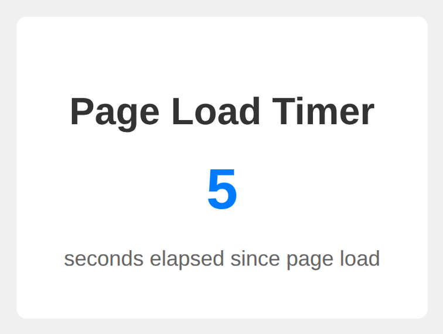

# Problem 1: Date Timing for an Interactive Timer

Edit `Lesson 1.1/main-1.js`:

Create an interactive timer showing elapsed time since page load.

1. Create a variable called `pageLoadTime` whose value is set to the current timestamp using `Date.now()` when the page loads
2. Create a function called `updateDisplay` that:
    - Calculates the time passed in milliseconds by subtracting `pageLoadTime` from the current timestamp (`Date.now()`)
    - Converts the milliseconds to seconds by dividing by `1000`
    - Rounds the seconds to the nearest integer using `Math.round()`
    - Updates the text content of an HTML element with id `"timer"` to display the rounded seconds
3. Call `updateDisplay()` once so the timer shows `0` right away.
4. Use `setInterval(updateDisplay, 1000)` to run `updateDisplay` again every 1000 milliseconds (once per second), so the timer keeps counting up.

The timer keeps counting up as time passes. About five seconds after the page loads, it should look similar to this image:

---

Course 2, Module 4 - practice assignment (ungraded): [Practice: Animating in JavaScript](https://www.coursera.org/learn/building-interactive-web-applications-with-javascript/programming/utqCR/practice-animating-in-javascript) - `Lesson 1.1`

The files here are the starter you get in the course. The finished `main-1.js` is in the [solution folder on GitHub](https://github.com/soney/Practical-JavaScript/tree/main/assignments/Course%202/Module%204/Lesson%201/Lesson%201.1/solution); in the course codespace that folder is hidden so you can work the problem first.
