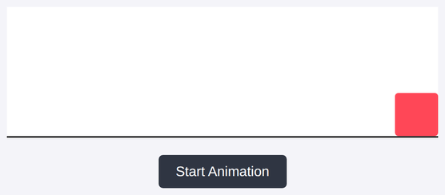

# Problem 2: Animation Frames for a Sliding Box

Edit `Lesson 1.2/main-2.js`:

Practice using `requestAnimationFrame` and time-based interpolation instead of fixed increments. The element references and a `setBoxPosition` function are already provided for you at the top of `main-2.js`. `setBoxPosition(x)` moves the box to a horizontal position `x` (in pixels), so you can focus on the animation itself. The click handler that starts the animation is also provided for you at the bottom of the file; it calls `runAnimation(2000, 450)` to move the box to `x = 450` over 2 seconds.

Fill in the provided `runAnimation` function. It takes two parameters:
- `duration` (in milliseconds)
- `toX` (the horizontal position to move to, in pixels)

Inside `runAnimation`:
- Capture the start time using `Date.now()`.
- Define a `step` function inside `runAnimation`:
    - Calculate `pct` (a value between `0` and `1`) as the elapsed time divided by `duration`.
    - If `pct < 1`, the animation is still going: call `setBoxPosition(pct * toX)`, then call `requestAnimationFrame(step)` to schedule the next frame.
    - Otherwise, the animation is done: call `setBoxPosition(toX)` so the box snaps to its final position.
- After defining `step`, start the animation by calling `requestAnimationFrame(step)`.

After the animation finishes, the box has moved all the way to the right side of the stage. The page should look similar to this image:

---

Course 2, Module 4 - practice assignment (ungraded): [Practice: Animating in JavaScript](https://www.coursera.org/learn/building-interactive-web-applications-with-javascript/programming/utqCR/practice-animating-in-javascript) - `Lesson 1.2`

The files here are the starter you get in the course. [`solution/main-2.js`](solution/main-2.js) is the finished `main-2.js`; copy it over the starter to run the completed assignment.
