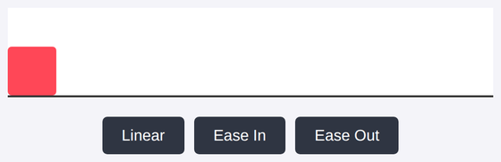

# Problem 3: Easing Functions for Smooth Animation

Edit `Lesson 1.3/main-3.js`:

In the previous lesson the box moved at a constant speed (a linear animation). Real animations often speed up or slow down instead. An *easing function* does that: it takes the animation's progress `t` (a number from `0` to `1`) and returns an adjusted progress, also from `0` to `1`. Feeding the eased value into the position makes the box accelerate or decelerate.

The element references, a `setBoxPosition(x)` helper, and an `easings` object are already provided for you at the top of `main-3.js`. `easings` holds three functions:

- `easings.linear` moves at a constant speed.
- `easings.easeIn` starts slow and speeds up.
- `easings.easeOut` starts fast and slows down.

The three buttons are also already wired up for you at the bottom of the file: each one calls `runAnimation(2000, 450, ...)` with a different easing function.

Fill in the provided `runAnimation` function. It takes three parameters: `duration` (in milliseconds), `toX` (the horizontal position to move to, in pixels), and `easing` (one of the easing functions).
- Capture the start time with `Date.now()`.
- Define a `step` function inside `runAnimation`:
    - Calculate `pct` (the raw progress from `0` to `1`) as the elapsed time divided by `duration`.
    - If `pct < 1`, call `setBoxPosition(easing(pct) * toX)`. The key idea is that the raw `pct` is passed through `easing` first, which is what makes the motion speed up or slow down. Then call `requestAnimationFrame(step)`.
    - Otherwise, call `setBoxPosition(toX)` so the box lands exactly at the end.
- Start the animation with `requestAnimationFrame(step)`.

Click each button to compare how the easing changes the way the box moves. After any animation finishes, the box has moved all the way across the stage.

---

Course 2, Module 4 - practice assignment (ungraded): [Practice: Animating in JavaScript](https://www.coursera.org/learn/building-interactive-web-applications-with-javascript/programming/utqCR/practice-animating-in-javascript) - `Lesson 1.3`

The files here are the starter you get in the course. [`solution/main-3.js`](solution/main-3.js) is the finished `main-3.js`; copy it over the starter to run the completed assignment.
