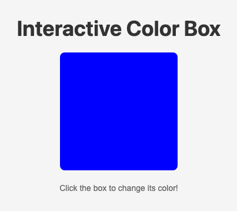

# Problem 1: CSS Transitions for an Animated Box

Edit `Lesson 2.1/index.html`:

The JavaScript in `main-1.js` is already written for you: it toggles the box between blue and red every time you click it. Right now the color changes instantly. Your job is to make it animate smoothly by adding a CSS **transition**, written as real CSS in the `<style>` block of `index.html`.

1. Open `index.html` and find the `#colorBox` rule inside the `<style>` block.
2. Add a `transition` property to that rule so changes to `background-color` animate over **1 second** using `ease-in-out` timing:

    ```css
    transition: background-color 1s ease-in-out;
    ```

3. Save and click the box. The color should now fade smoothly between blue and red instead of snapping.

When the page loads, before the box is clicked, the page should look similar to this image:



---

Course 2, Module 4 - practice assignment (ungraded): [Practice: Animation in CSS](https://www.coursera.org/learn/building-interactive-web-applications-with-javascript/programming/5yC9w/practice-animation-in-css) - `Lesson 2.1`

The files here are the starter you get in the course. The finished `index.html` is in the [solution folder on GitHub](https://github.com/soney/Practical-JavaScript/tree/main/assignments/Course%202/Module%204/Lesson%202/Lesson%202.1/solution); in the course codespace that folder is hidden so you can work the problem first.
