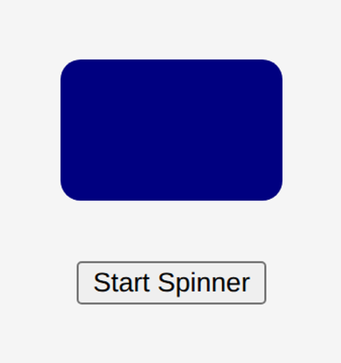

# Problem 2: Keyframes for a Loading Spinner

Edit `Lesson 2.2/index.html`:

Use `@keyframes` to build a looping animation, written as real CSS. The JavaScript in `main-2.js` is already written for you: clicking the button toggles a `spinner` class on the loading element (and switches the button text between `Start Spinner` and `Stop Spinner`).

The `.spinner` class is already in the `<style>` block of `index.html`, and it references an animation named `pulse-rotate`:

```css
.spinner {
  /* ...size and color... */
  animation: pulse-rotate 2s linear infinite;
}
```

That animation does not exist yet, so nothing moves. Your job is to define it.

A `@keyframes` rule can animate more than one property at once. In the `<style>` block of `index.html` (where the `TODO` comment is), add a `@keyframes` rule named `pulse-rotate` that animates the `transform` (for the rotation), the `background-color`, the `width`, and the `height` across these three stages:

- **0%**: `transform: rotate(0deg);` `background-color: navy;` `width: 110px;` `height: 70px;`
- **50%**: `transform: rotate(180deg);` `background-color: gold;` `width: 160px;` `height: 100px;`
- **100%**: `transform: rotate(360deg);` `background-color: navy;` `width: 110px;` `height: 70px;`

For example, a `@keyframes` rule looks like:

```css
@keyframes pulse-rotate {
  0% {
    transform: rotate(0deg);
    background-color: navy;
    width: 110px;
    height: 70px;
  }
  /* ...the 50% and 100% stages... */
}
```

Once the rule is in place, click `Start Spinner`: the box will rotate a full turn while its color shifts and it grows and shrinks, every 2 seconds.

When the page loads, the page should look similar to this image:



---

Course 2, Module 4 - practice assignment (ungraded): [Practice: Animation in CSS](https://www.coursera.org/learn/building-interactive-web-applications-with-javascript/programming/5yC9w/practice-animation-in-css) - `Lesson 2.2`

The files here are the starter you get in the course. The finished `index.html` is in the [solution folder on GitHub](https://github.com/soney/Practical-JavaScript/tree/main/assignments/Course%202/Module%204/Lesson%202/Lesson%202.2/solution); in the course codespace that folder is hidden so you can work the problem first.
