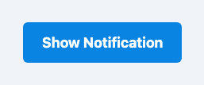

# Problem 3: Web Animations for Notifications

Edit `Lesson 2.3/main-3.js`:

Use the JavaScript `.animate()` method to create animations that react to data or user interaction.

Every element has an `.animate(keyframes, options)` method. You pass it two things:

- **`keyframes`**: an array of "snapshots" of CSS styles that the browser smoothly animates between. Property names use JavaScript style (camelCase, so `transform`, not a dashed name), and the values are strings. For example:

    ```js
    const keyframes = [
      { opacity: 0, transform: 'scale(0.5)' }, // first snapshot
      { opacity: 1, transform: 'scale(1)' },   // last snapshot
    ];
    ```

    By default the snapshots are spread evenly across the animation. You can control when a snapshot happens by giving it an `offset` between `0` (the very start) and `1` (the very end). Putting `offset: 0.1` on the middle keyframe means it is reached at 10% of the duration, so the fade-in finishes quickly and the rest of the time is spent fading back out.

- **`options`**: an object that controls the timing, such as `duration` (in milliseconds), `easing`, and `fill`.

`element.animate(...)` returns an Animation object. Its `.finished` property is a Promise that resolves when the animation is done, so you can run code afterward with `anim.finished.then(() => { ... })`.

Now build the notification. Define a function called `triggerNotification` that takes one argument: `element`.

1. Define the Keyframes
    Create an array of keyframes with the following stages:

    - **Start keyframe**
        - `opacity: 0`
        - `transform: translateY(-20px)`

    - **Middle keyframe**
        - `opacity: 1`
        - `transform: translateY(0)`
        - Add `offset: 0.1` so the fade-in happens quickly.

    - **End keyframe**
        - `opacity: 0`
        - `transform: translateY(20px)`

2. Define the Animation Options
    Create an options object with the following properties:
    - `duration`: `3000` (3 seconds)
    - `easing`: `ease-in`
    - `fill`: `forwards`

3. Run the Animation
    - Call `element.animate(keyframes, options)` and store the returned animation in a constant called `anim`.

4. Handle Completion
    - Use the `.finished` property of the animation object.
    - Log **"Notification cleared"** to the console once the fade-out animation is complete.

A second function, `setupNotificationDemo`, is **already provided for you** at the bottom of `main-3.js`: it selects the button and the notification element and, on each click, calls your `triggerNotification`. The page runs `setupNotificationDemo` automatically when it loads, so once `triggerNotification` is filled in, clicking the button plays the animation.

After the fade animation starts, the page should look similar to this image:



---

Course 2, Module 4 - practice assignment (ungraded): [Practice: Animation in CSS](https://www.coursera.org/learn/building-interactive-web-applications-with-javascript/programming/5yC9w/practice-animation-in-css) - `Lesson 2.3`

The files here are the starter you get in the course. [`solution/main-3.js`](solution/main-3.js) is the finished `main-3.js`; copy it over the starter to run the completed assignment.
