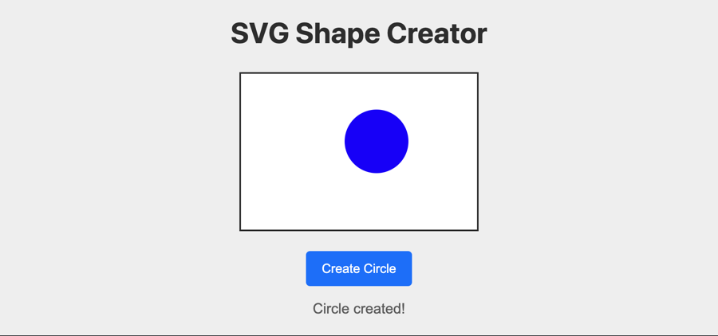

# Problem 1: SVG Circles for Dynamic Graphics

Edit `Lesson 3.1/main-1.js`:

Define a function called `createCircle` that takes in three number arguments: cx, cy, and radius, which creates an SVG circle element and appends it to the SVG container on the page.

Within the `createCircle` function:
1. Create an SVG circle element using document.createElementNS with the SVG namespace `'http://www.w3.org/2000/svg'` and element name `'circle'`
2. Set the circle's attributes using `setAttribute`:
    - Set the `'cx'` attribute to the cx parameter (x-coordinate of center)
    - Set the `'cy'` attribute to the cy parameter (y-coordinate of center)
    - Set the `'r'` attribute to the radius parameter
    - Set the `'fill'` attribute to `'blue'`
3. Select the SVG container by using document.querySelector to select the element with id `'svgCanvas'`
4. Append the circle to the SVG container using `.append()`
5.  Update the status text by:
    - Selecting the element with id `'status'`
    - Setting its textContent to `'Circle created!'`
6. Return the circle element that was created

After calling `createCircle(170, 85, 40)`, the page should look similar to this image:

---

Course 2, Module 4 - practice assignment (ungraded): [Practice: Custom SVG Drawings](https://www.coursera.org/learn/building-interactive-web-applications-with-javascript/programming/LZyyG/practice-custom-svg-drawings) - `Lesson 3.1`

The files here are the starter you get in the course. [`solution/main-1.js`](solution/main-1.js) is the finished `main-1.js`; copy it over the starter to run the completed assignment.
