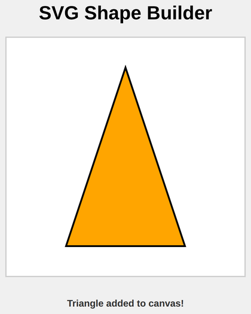

# Problem 2: SVG Polygons for a Triangle Drawing

Edit `Lesson 3.2/main-2.js`:

Draw a static triangle using the SVG `<polygon>` element and add it to the page. The triangle should be drawn as soon as the page loads.

1. Create the polygon element
    - Create a `polygon` element using `document.createElementNS` with:
        - The SVG namespace string `'http://www.w3.org/2000/svg'`
        - The element name `'polygon'`

2. Set the polygon's attributes with `setAttribute`:
    - `points`: `'200,50 300,350 100,350'`
    - `fill`: `'orange'`
    - `stroke`: `'black'`
    - `stroke-width`: `'3'`

3. Add the polygon to the canvas
    - Select the element with the id `svgCanvas` using `document.querySelector`.
    - Append the polygon to it with `.append()`.

4. Update the message
    - Select the element with the id `message` using `document.querySelector`.
    - Set its `textContent` to `"Triangle added to canvas!"`.

When the page loads, the triangle is drawn and the page should look similar to this image:

---

Course 2, Module 4 - practice assignment (ungraded): [Practice: Custom SVG Drawings](https://www.coursera.org/learn/building-interactive-web-applications-with-javascript/programming/LZyyG/practice-custom-svg-drawings) - `Lesson 3.2`

The files here are the starter you get in the course. [`solution/main-2.js`](solution/main-2.js) is the finished `main-2.js`; copy it over the starter to run the completed assignment.
