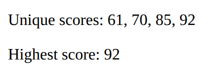

# Problem 3: Install and Use the Lodash Library

Edit `Problem 3/src/index.js`:

This project is built with webpack, which bundles your code and any libraries it imports into a single `dist/main.js` file. Your task is to install the third-party library Lodash with npm, then import it in `src/index.js` and use it to summarize a list of scores.

The other files support the build, and you do not need to edit them:

- `webpack.config.js` bundles `src/index.js` (and anything it imports) into `dist/main.js`.
- `src/index.html` is the page template. It contains an empty element with ID `app`.
- `serve.js` serves the built `dist/` folder so the page can load.

## Part 1: Install Lodash

In the terminal, from the `Problem 3` folder, install Lodash with npm:

```text
npm install lodash
```

This does two things: it adds `"lodash"` to the `dependencies` in `package.json`, and it downloads the Lodash code into the `node_modules` folder. Once Lodash is in `node_modules`, webpack can find it and include it in the bundle.

Problem 1 loaded Lodash from a CDN with a `<script>` tag. Here you install Lodash as a package instead, and webpack bundles it into your app.

## Part 2: Use Lodash in `src/index.js`

The file `src/index.js` already defines this array:

```javascript
const scores = [70, 92, 70, 85, 92, 61];
```

1. At the top of the file, import the installed library as `_`:

   ```javascript
   import _ from 'lodash';
   ```

2. Using the Lodash `_` object, compute three values:

   - `unique`: the scores with duplicates removed. Use `_.uniq(scores)`.
   - `ranked`: those unique scores sorted from lowest to highest. Use `_.sortBy(unique)`.
   - `highest`: the highest score. Use `_.max(scores)`.

3. Select the element with ID `app` and render the values with this exact markup:

   ```javascript
   document.querySelector('#app').innerHTML =
     `<p>Unique scores: ${_.join(ranked, ', ')}</p>` +
     `<p>Highest score: ${highest}</p>`;
   ```

When the project is built and the page loads, the `app` element displays:

```
Unique scores: 61, 70, 85, 92
Highest score: 92
```

Before your edit, `src/index.js` does not import or use Lodash, so the `app` element stays empty and Lodash is not part of the bundle.

The resulting page should look similar to this image:



---

Course 3, Module 1 - graded assignment: [Module 1 Graded Assignment](https://www.coursera.org/learn/developing-full-stack-applications-with-javascript/programming/YdV3u/module-1-graded-assignment) - `Problem 3`

The files here are the starter you get in the course. Solutions to graded
assignments are not published.
