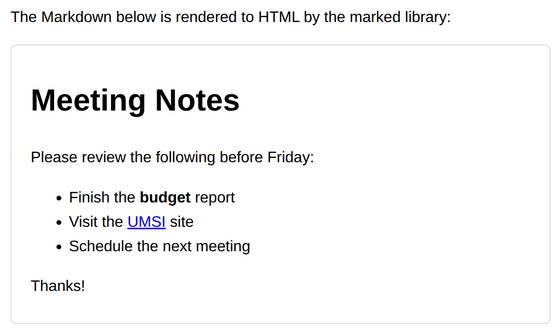

# Problem 3: Render Markdown With the `marked` Library

Edit `Lesson 2.3/index.html` and `Lesson 2.3/main-3.js`:

Not every external library is a set of data helpers like Lodash. This page uses a different popular library, [marked](https://marked.js.org), which turns **Markdown** text into HTML. Markdown is the same plain-text formatting used in README files and many chat apps: `#` makes a heading, `-` makes a list item, `**bold**` makes bold text, and `[text](url)` makes a link.

To use a library from a CDN you first have to load it. Do the following:

1. Load the library (in `index.html`).
    - In the `<head>` of `index.html`, where the `TODO` comment is, add a `<script>` tag that loads marked from the CDN, using the `defer` attribute so it loads before `main-3.js`:

    ```html
    <script src="https://cdn.jsdelivr.net/npm/marked@4.3.0/marked.min.js" defer></script>
    ```

    Because it is loaded first, a global `marked` object becomes available to your code. Your `main-3.js` already defines a `markdown` string and a reference to the output element (`const output = document.querySelector('#output')`).

2. Convert the Markdown to HTML (in `main-3.js`).
    - Call `marked.parse(markdown)`. It returns a string of HTML (for example, the `#` line becomes an `<h1>` and each `-` line becomes an `<li>`).

3. Show it on the page (in `main-3.js`).
    - Put that HTML inside the output element by setting `output.innerHTML` to the result.

When it works, the `#output` box shows a formatted heading, a bulleted list, bold text, and a clickable link, all generated from the Markdown string by the library. The page should look similar to this image:



## Library documentation

- marked 4.3.0: [documentation](https://marked.js.org/), [npm package](https://www.npmjs.com/package/marked/v/4.3.0), [github (tag v4.3.0)](https://github.com/markedjs/marked/tree/v4.3.0)

---

Course 3, Module 1 - practice assignment (ungraded): [Practice: External Libraries](https://www.coursera.org/learn/developing-full-stack-applications-with-javascript/programming/Q6bA8/practice-external-libraries) - `Lesson 2.3`

The files here are the starter you get in the course. The finished `index.html` and `main-3.js` are in the [solution folder on GitHub](https://github.com/soney/Practical-JavaScript/tree/main/assignments/Course%203/Module%201/Lesson%202/Lesson%202.3/solution); in the course codespace that folder is hidden so you can work the problem first.
