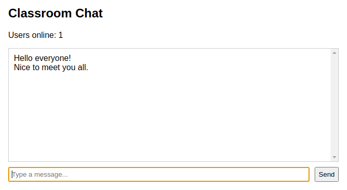

# Problem 3: Handling Multiple WebSocket Clients - Live User Count

Edit `Lesson 3.3/client-3.js` and `Lesson 3.3/server.js`:

- `Lesson 3.3/server.js`: broadcast a live user count whenever a client connects or disconnects.
- `Lesson 3.3/client-3.js`: render everything the server broadcasts.

**Setup:** the server uses the `ws` package. It is preinstalled in the course lab; if you are working on your own computer, run `npm install ws` in the `Lesson 3.3` folder first, then start the server with `node server.js`.

A chat room must handle many WebSocket connections at the same time. In this problem the server keeps everyone informed about how many clients are connected right now.

The server already sanitizes and broadcasts chat messages; that part is written for you (it is the same pattern you built in the previous problem). On the client, the submit handler that sends a chat message and clears the input is also written for you (again, the same pattern as the previous problem). Because the server now sends two different kinds of messages, every message it broadcasts is a JSON string with a `type` property:

- `{ "type": "chat", "text": "Hello!" }` - a chat message.
- `{ "type": "count", "count": 2 }` - the number of connected clients.

Do the following:

1. Broadcast the User Count (in `server.js`)
    - Complete the `broadcastCount()` function:
        - Count the connected clients: loop over `wss.clients` with `for...of` and count only the clients whose `readyState` is `WebSocket.OPEN`.
        - Send the JSON string `JSON.stringify({ type: 'count', count: <the number you counted> })` to each of those open clients.
    - Call `broadcastCount()` when a client connects, and again when a client disconnects (inside the provided `close` handler).

2. Render Incoming Messages (in `client-3.js`)
    - When a message arrives, parse it with `JSON.parse(messageText(event))`. The provided `messageText()` helper returns the text whether the message arrived as text or as binary data.
    - If the message's `type` is `'count'`, set the text of the element with ID `user-count` to `Users online: ` followed by the count (for example `Users online: 1`).
    - If the message's `type` is `'chat'`, create an `<li>`, set its `textContent` to the message's `text`, and append it to `#chat-box`. Use `textContent` (not `innerHTML`) so HTML inside a message is displayed as plain text instead of running.

After the server is running, one browser tab is connected, and two messages have been sent, the page should look similar to this image:

---

Course 3, Module 2 - practice assignment (ungraded): [Practice: Real-Time Communication](https://www.coursera.org/learn/developing-full-stack-applications-with-javascript/programming/nF7pb/practice-real-time-communication) - `Lesson 3.3`

The files here are the starter you get in the course. The finished `client-3.js` and `server.js` are in the [solution folder on GitHub](https://github.com/soney/Practical-JavaScript/tree/main/assignments/Course%203/Module%202/Lesson%203/Lesson%203.3/solution); in the course codespace that folder is hidden so you can work the problem first.
