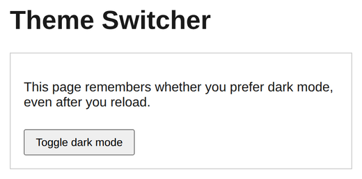
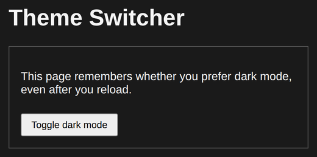

# Problem 2: Remembering Dark Mode with localStorage

Edit `Problem 2/main-2.js`:

Build a theme switcher that remembers whether the visitor prefers dark mode, so the page stays in dark mode after a reload. The page in `index.html` already has the heading, the content card, and a toggle button, and its `<style>` element already defines a dark theme that applies whenever `document.body` has the `dark` class. Do not edit `index.html`.

`localStorage` is the browser's built-in key-value store. It keeps string values even after the page is reloaded or closed. The two methods you need are:

- `localStorage.setItem('theme', value)` saves a value under a key.
- `localStorage.getItem('theme')` reads the value back, or returns `null` if nothing is saved yet.

You switch the theme by adding or removing the `dark` class on `document.body`:

- `document.body.classList.add('dark')` turns dark mode on.
- `document.body.classList.toggle('dark')` turns it on if it is off, and off if it is on.
- `document.body.classList.contains('dark')` returns `true` when dark mode is on.

Implement `setupDarkMode()` so it does all of the following. The starter already selects `#toggle-button` for you.

1. Read the saved theme from `localStorage` using the key `theme`. If the saved value is the exact string `dark`, add the `dark` class to `document.body` so the page opens in dark mode.
2. Add a `click` event listener to `#toggle-button`. When it is clicked:
   - Toggle the `dark` class on `document.body`.
   - Check whether `document.body` now has the `dark` class.
   - Save the exact string `dark` to `localStorage` under the key `theme` when dark mode is on, or the exact string `light` when it is off.

For example, after a visitor clicks the button to turn on dark mode and then reloads the page, the page should still be in dark mode.

The `DOMContentLoaded` code at the bottom of `main-2.js` already calls `setupDarkMode()` for you. Keep it as is.

The page starts in light mode like this:

After clicking the toggle button to turn on dark mode, the page should look similar to this image:

---

Course 3, Module 3 - graded assignment: [Module 3 Graded Assignment](https://www.coursera.org/learn/developing-full-stack-applications-with-javascript/programming/FRlxO/module-3-graded-assignment) - `Problem 2`

The files here are the starter you get in the course. Solutions to graded
assignments are not published.
