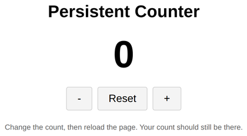

# Problem 1: Persisting a Counter with localStorage

Edit `Lesson 1.1/main-1.js`:

The page has a counter with three buttons: `+` increases the count, `-` decreases it, and `Reset` sets it back to 0. All of that is already written for you. The problem is that the count resets every time the page reloads. Your job is to make it **persistent** using `localStorage`, so the count is remembered across reloads.

`localStorage` is the browser's built-in key-value store. It keeps strings even after the page is closed or reloaded. The two methods you need are:

- `localStorage.setItem('count', count)` saves a value under a key.
- `localStorage.getItem('count')` reads the value back (or returns `null` if nothing is saved yet).

1. **Load the saved count when the page opens.** Change the starting value of `count` so it reads from storage: use `Number(localStorage.getItem('count'))` to turn the saved string back into a number. If nothing is saved yet, fall back to `0` (for example, `Number(localStorage.getItem('count')) || 0`).

2. **Save the count whenever it changes.** Inside `updateDisplay` (which already runs after every button click), add `localStorage.setItem('count', count)` so the latest value is always stored.

Test it yourself: click `+` a few times, then reload the page. The count should still be there.

When the page loads, the counter should look similar to this image:

---

Course 3, Module 3 - practice assignment (ungraded): [Practice: Client-Side Storage](https://www.coursera.org/learn/developing-full-stack-applications-with-javascript/programming/STvSE/practice-client-side-storage) - `Lesson 1.1`

The files here are the starter you get in the course. The finished `main-1.js` is in the [solution folder on GitHub](https://github.com/soney/Practical-JavaScript/tree/main/assignments/Course%203/Module%203/Lesson%201/Lesson%201.1/solution); in the course codespace that folder is hidden so you can work the problem first.
