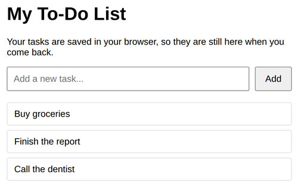

# Problem 3: A Persistent To-Do List with localStorage

Edit `Lesson 1.3/main-3.js`:

Build a to-do list whose tasks are saved in the browser with `localStorage`, so they are still there after the page reloads.

The DOM references, the "Add" button wiring, and a `renderTodos()` function that draws the list are already provided for you at the bottom of `main-3.js`. Tasks are stored under the localStorage key `"todos"` as a JSON array of strings (this key is available to you as the `STORAGE_KEY` constant).

Write these three functions:

1. `getTodos()` - read the saved tasks and return them as an array.
    - Read the string stored under `STORAGE_KEY` with `localStorage.getItem(STORAGE_KEY)`.
    - If nothing is stored yet, return an empty array `[]`.
    - Otherwise, use `JSON.parse()` to turn the stored string back into an array and return it.

2. `saveTodos(todos)` - save the given array of tasks.
    - Use `JSON.stringify(todos)` to turn the array into a string, then store it with `localStorage.setItem(STORAGE_KEY, ...)`.

3. `addTodo(text)` - add one task, then save and redraw.
    - Get the current tasks with `getTodos()`.
    - Add `text` to the end of the array with `.push(text)`.
    - Save the updated array with `saveTodos(...)`.
    - Call `renderTodos()` so the new task shows up.

Type a task and click **Add**, then reload the page: your tasks should still be there.

---

Course 3, Module 3 - practice assignment (ungraded): [Practice: Client-Side Storage](https://www.coursera.org/learn/developing-full-stack-applications-with-javascript/programming/STvSE/practice-client-side-storage) - `Lesson 1.3`

The files here are the starter you get in the course. [`solution/main-3.js`](solution/main-3.js) is the finished `main-3.js`; copy it over the starter to run the completed assignment.
