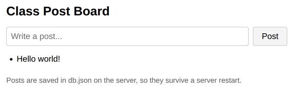

# Problem 1: Saving Posts with lowdb

Edit `Lesson 2.1/server.js`:

This server is a post board API. The web server code and the page it serves are already written. The problem is that the server has no database yet, so it cannot remember any posts. Your job is to store the posts in a lowdb database backed by a `db.json` file, so posts survive a server restart.

lowdb keeps its data in `db.data` in memory. `await db.read()` loads `db.json` into `db.data`, and `await db.write()` saves `db.data` back to `db.json`. Follow the four `TODO` comments in `server.js`:

1. Set up the database at the top of the file:
   - Create the adapter: `const adapter = new JSONFile('db.json');`
   - Create the starting data used when `db.json` does not exist yet: `const defaultData = { posts: [] };`
   - Create the database object: `const db = new Low(adapter, defaultData);`
   - These replace the `const db = null;` line. The `Low` and `JSONFile` imports are already at the top of the file.
2. Load the saved data once, before the server handles requests, by adding: `await db.read();`
3. In the `GET /posts` route, respond with every saved post:
   - `res.writeHead(200, { 'Content-Type': 'application/json' });`
   - `res.end(JSON.stringify(db.data.posts));`
4. In the `POST /posts` route, save the new post and confirm it:
   - Add the post text to the array: `db.data.posts.push(body.text);`
   - Write the change to `db.json`: `await db.write();`
   - Respond with status `201`: `res.writeHead(201, { 'Content-Type': 'application/json' });` and `res.end(JSON.stringify({ message: 'Post saved' }));`

Do not edit `index.html` or `client.js`. They are the provided page, and they call `GET /posts` and `POST /posts` for you.

After you add the post `Hello world!` on the page, it should look similar to this image:

**How to test your code:** In the Coursera lab, open a terminal and start your server by running `node server.js` inside the `Lesson 2.1` folder. Then open a browser preview inside the Coursera lab and go to `localhost:3000`. Add a post, then stop the server (press `Ctrl+C`), start it again with `node server.js`, and reload the page. Your post should still be there, and you should see it saved inside the new `db.json` file.

---

Course 3, Module 3 - practice assignment (ungraded): [Practice: Server-Side Storage](https://www.coursera.org/learn/developing-full-stack-applications-with-javascript/programming/Ovciw/practice-server-side-storage) - `Lesson 2.1`

The files here are the starter you get in the course. [`solution/server.js`](solution/server.js) is the finished `server.js`; copy it over the starter to run the completed assignment.
