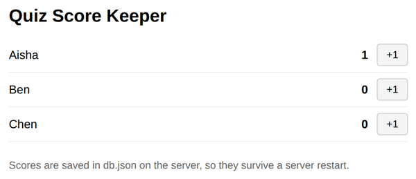

# Problem 2: Updating Records in a lowdb Database

Edit `Lesson 2.2/server.js`:

This server keeps quiz scores for three players in a lowdb database. The database setup, `await db.read()`, and the web server are already written. The database starts with three players, each with a `score` of `0`:

```js
{ players: [ { name: 'Aisha', score: 0 }, { name: 'Ben', score: 0 }, { name: 'Chen', score: 0 } ] }
```

Your job is to finish the two data routes, marked with `TODO` comments in `server.js`:

1. In the `GET /players` route, respond with every player:
   - `res.writeHead(200, { 'Content-Type': 'application/json' });`
   - `res.end(JSON.stringify(db.data.players));`
2. In the `POST /score` route, add one point to the player whose name is in `body.name`. The `body` object is already read for you:
   - Find the player record: `const player = db.data.players.find((p) => p.name === body.name);`
   - If there is no matching player, respond with status `404` and the JSON message `{ message: 'Player not found' }`, then `return;`.
   - Add the point by updating the record: `player.score = player.score + 1;`
   - Save the change to `db.json`: `await db.write();`
   - Respond with status `200` and the JSON body `{ message: 'Score updated', score: player.score }`.

Because `player` is a reference to the object inside `db.data.players`, changing `player.score` changes the database data in memory. `await db.write()` then saves it to `db.json`.

Do not edit `index.html` or `client.js`. They are the provided page: it lists every player with a `+1` button that calls `POST /score`.

When the page loads with the starting scores and one point has been added to `Aisha`, it should look similar to this image:



**How to test your code:** In the Coursera lab, open a terminal and start your server by running `node server.js` inside the `Lesson 2.2` folder. Then open a browser preview inside the Coursera lab and go to `localhost:3000`. Click a few `+1` buttons, then stop the server (press `Ctrl+C`), start it again, and reload the page. The scores should still be there.

---

Course 3, Module 3 - practice assignment (ungraded): [Practice: Server-Side Storage](https://www.coursera.org/learn/developing-full-stack-applications-with-javascript/programming/Ovciw/practice-server-side-storage) - `Lesson 2.2`

The files here are the starter you get in the course. [`solution/server.js`](solution/server.js) is the finished `server.js`; copy it over the starter to run the completed assignment.
