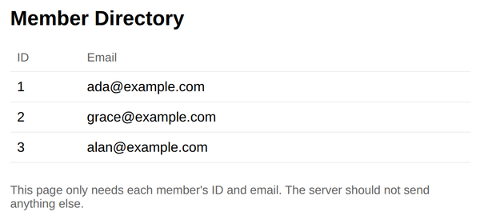

# Problem 3: Serving Only Public User Data

Edit `Lesson 2.3/server.js`:

This server is a member directory API. Its lowdb database stores three users, and each user record contains four fields: `id`, `email`, `passwordHash`, and `recoveryCode`.

Right now the `GET /users` route responds with the complete user records, so anyone who requests `/users` receives every user's `passwordHash` and `recoveryCode`. That is a data leak. The directory page only needs each member's ID and email, and a server should never send more data than the page needs.

Fix the leak by following the two `TODO` comments in `server.js`:

1. Define a function named `publicAccount` that takes one user object and returns a **new** object containing only the fields that are safe to share: the member's `id` and `email`. The safe approach is to list those public fields explicitly and copy them onto a fresh object. That way, if a private field is ever added to a user record later, it stays private by default instead of leaking. Do not try to delete fields off the original record; build and return a new object.

2. In the `GET /users` route, the `res.end(...)` line currently sends the raw `db.data.users` array. Change it so it sends a new array in which every user has first been passed through your `publicAccount` function. Think about which array method takes an array and gives you back a new array with each element transformed.

After your fix, `GET /users` must still respond with all three users, each with its `id` and `email`, and must not include `passwordHash` or `recoveryCode` anywhere in the response.

Do not edit `index.html` or `client.js`. They are the provided directory page, and the page keeps working before and after the fix; the difference is what the server exposes to anyone who requests `/users` directly.

When the page loads, it should look similar to this image:

**How to test your code:** In the Coursera lab, open a terminal and start your server by running `node server.js` inside the `Lesson 2.3` folder. Then open a browser preview inside the Coursera lab and go to `localhost:3000/users`. Before your fix you can see every user's `passwordHash` and `recoveryCode` in the response; after your fix, only `id` and `email` should appear.

---

Course 3, Module 3 - practice assignment (ungraded): [Practice: Server-Side Storage](https://www.coursera.org/learn/developing-full-stack-applications-with-javascript/programming/Ovciw/practice-server-side-storage) - `Lesson 2.3`

The files here are the starter you get in the course. [`solution/server.js`](solution/server.js) is the finished `server.js`; copy it over the starter to run the completed assignment.
