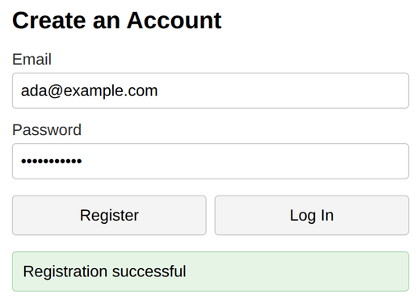

# Problem 1: User Registration and Login Routes

Edit `Lesson 3.1/server.js`:

This Express server has a registration form page already built. The server stores accounts in an in-memory object named `users`, which maps an email to `{ password }`. Your job is to implement the two routes the page calls: `POST /register` and `POST /login`. Follow the `TODO` comments in `server.js`.

In the `POST /register` route:

1. Read the submitted values: `const { email, password } = req.body;` (the `express.json()` middleware already parses the body for you).
2. If either value is missing, respond with status `400` and the JSON message `{ message: "Email and password required" }`, then `return;`.
3. If `users[email]` already exists, respond with status `409` and `{ message: "User already exists" }`, then `return;`.
4. Store the new account: `users[email] = { password };`
5. Respond with `res.json({ message: "Registration successful" });`

In the `POST /login` route:

1. Read `email` and `password` from `req.body` and look up `const user = users[email];`
2. If there is no user, or `user.password` does not equal the submitted password, respond with status `401` and `{ message: "Invalid credentials" }`, then `return;`. Use that same message for both cases: a generic error means someone probing your server cannot tell whether the email exists.
3. Otherwise respond with `res.json({ message: "Login successful" });`

Do not edit `index.html` or `client.js`. They are the provided page: the `Register` button calls `POST /register`, the `Log In` button calls `POST /login`, and the message from your server appears under the buttons.

After registering with an email and password, the page should look similar to this image:

**How to test your code:** In the Coursera lab, open a terminal and start your server by running `node server.js` inside the `Lesson 3.1` folder. Then open a browser preview inside the Coursera lab and go to `localhost:3000`. Register an account, try registering the same email again (you should see `User already exists`), then log in with the right and wrong password. Accounts live in server memory, so restarting the server clears them.

---

Course 3, Module 3 - practice assignment (ungraded): [Practice: User Authentication](https://www.coursera.org/learn/developing-full-stack-applications-with-javascript/programming/oG3TK/practice-user-authentication) - `Lesson 3.1`

The files here are the starter you get in the course. The finished `server.js` is in the [solution folder on GitHub](https://github.com/soney/Practical-JavaScript/tree/main/assignments/Course%203/Module%203/Lesson%203/Lesson%203.1/solution); in the course codespace that folder is hidden so you can work the problem first.
