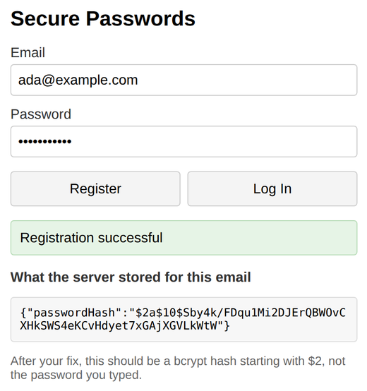

# Problem 2: Hashing Passwords with bcryptjs

Edit `Lesson 3.2/server.js`:

This registration and login server already works, but it stores every password as plain text. If anyone ever saw the server's stored data, they would have every user's real password. Your job is to fix that with `bcryptjs`, which is already imported for you as `bcrypt`. There are two `TODO` comments in `server.js`.

1. In the `POST /register` route, replace the line `users[email] = { password };` with two lines that hash the password and store only the hash:

   ```js
   const passwordHash = await bcrypt.hash(password, 10);
   users[email] = { passwordHash };
   ```

   The `10` is the cost factor: how much work bcrypt puts into the hash. The route is already declared `async`, so `await` works here.

2. In the `POST /login` route, a stored hash cannot be compared to the submitted password with `===`. Replace the `if (user.password !== password) { ... }` check with `bcrypt.compare`, which hashes the submitted password and checks it against the stored hash:

   ```js
   const valid = await bcrypt.compare(password, user.passwordHash);
   if (!valid) {
     res.status(401).json({ message: "Invalid credentials" });
     return;
   }
   ```

After your fix, registration and login must behave exactly as before from the user's point of view: correct passwords log in, wrong passwords get the generic `401` message. The difference is what the server stores.

Do not edit `index.html`, `client.js`, or the provided `GET /stored-users` route. The page uses that route to show you what the server actually stored for your email: before the fix it shows your real password; after the fix it should show a `passwordHash` value starting with `$2`.

After registering, the page should look similar to this image, with a hash instead of the typed password:



**How to test your code:** In the Coursera lab, open a terminal and start your server by running `node server.js` inside the `Lesson 3.2` folder. Then open a browser preview inside the Coursera lab and go to `localhost:3000`. Register an account and watch the "What the server stored" box: it must show a hash, not your password. Then log in with the right password (it should succeed) and a wrong one (it should fail).

---

Course 3, Module 3 - practice assignment (ungraded): [Practice: User Authentication](https://www.coursera.org/learn/developing-full-stack-applications-with-javascript/programming/oG3TK/practice-user-authentication) - `Lesson 3.2`

The files here are the starter you get in the course. The finished `server.js` is in the [solution folder on GitHub](https://github.com/soney/Practical-JavaScript/tree/main/assignments/Course%203/Module%203/Lesson%203/Lesson%203.2/solution); in the course codespace that folder is hidden so you can work the problem first.
