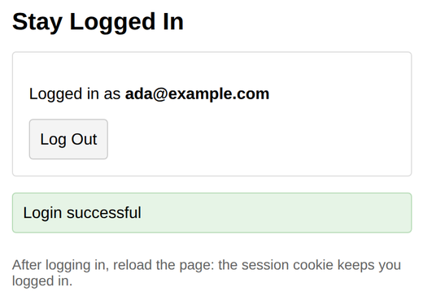

# Problem 3: Session Cookies for Login and Logout

Edit `Lesson 3.3/server.js`:

HTTP does not remember anything between requests, so after a successful login the server needs a way to recognize the same browser later. That is what sessions do: the server stores a session record and gives the browser a cookie holding the session ID.

In this server, registration and the password check are already written, and so is a `getSession(req)` helper that reads the `sessionId` cookie and returns `{ sessionId, email }` (or `null` when there is no valid session). Your job is the session handling, following the five `TODO` comments in `server.js`:

In `POST /login`, after the provided credential check:

1. Create the session. Session IDs must be impossible to guess, so use the built-in `crypto` module (already imported):
   - `const sessionId = crypto.randomUUID();`
   - `sessions[sessionId] = { email };`
2. Send the session ID to the browser as a cookie:

   ```js
   res.setHeader("Set-Cookie", `sessionId=${sessionId}; HttpOnly; SameSite=Strict; Max-Age=3600`);
   ```

   `HttpOnly` keeps page JavaScript from reading the cookie, and `Max-Age=3600` makes it last one hour.
3. Respond with `res.json({ message: "Login successful" });`

In `GET /me`:

4. Call `getSession(req)`. If it returns `null`, respond with status `401` and `{ message: "Not logged in" }`, then `return;`. Otherwise respond with `res.json({ email: session.email });`

In `POST /logout`:

5. Call `getSession(req)`. If there is a session, remove it with `delete sessions[session.sessionId];`. Then clear the browser's cookie by sending an empty value that expires immediately: `res.setHeader("Set-Cookie", "sessionId=; HttpOnly; Max-Age=0");` and respond with `res.json({ message: "Logged out" });`

Do not edit `index.html` or `client.js`. The provided page calls `GET /me` when it loads: if the session cookie is valid it shows "Logged in as ..." with a Log Out button, otherwise it shows the login form.

After registering and logging in, the page should look similar to this image:



**How to test your code:** In the Coursera lab, open a terminal and start your server by running `node server.js` inside the `Lesson 3.3` folder. Then open a browser preview inside the Coursera lab and go to `localhost:3000`. Register, log in, and reload the page: you should stay logged in, because the browser sends your session cookie with every request. Click `Log Out` and reload again: you should stay logged out.

---

Course 3, Module 3 - practice assignment (ungraded): [Practice: User Authentication](https://www.coursera.org/learn/developing-full-stack-applications-with-javascript/programming/oG3TK/practice-user-authentication) - `Lesson 3.3`

The files here are the starter you get in the course. The finished `server.js` is in the [solution folder on GitHub](https://github.com/soney/Practical-JavaScript/tree/main/assignments/Course%203/Module%203/Lesson%203/Lesson%203.3/solution); in the course codespace that folder is hidden so you can work the problem first.
