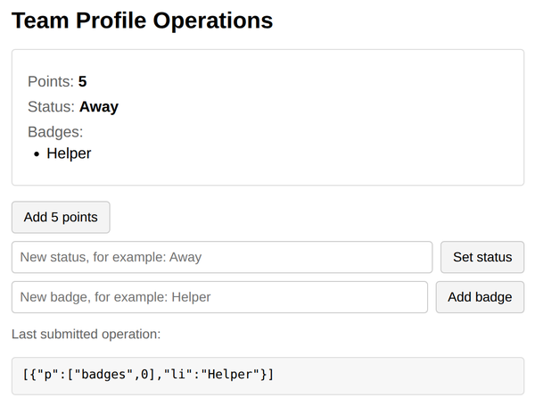

# Problem 1: Building json0 Operations

Edit `Lesson 4.1/main-1.js`:

ShareDB describes every change to a JSON document as an operation: an object with a path `p` (where the change happens) plus one action (what happens there). This page shows a team profile document:

```js
{ points: 0, status: 'Online', badges: [] }
```

The page, the rendering, and a local `submitOp(ops)` function are already written; `submitOp` applies your operations to the document exactly the way ShareDB would, and shows the last operation it received at the bottom of the page. Your job is to complete the three functions that build the operations, marked with `TODO` comments in `main-1.js`:

1. `createAddPointsOp()` must return an operation list that adds `5` to `points`. Adding to a number uses the `na` action:

   ```js
   return [{ p: ['points'], na: 5 }];
   ```

2. `createStatusOp(newStatus)` must return an operation list that replaces the `status` value. Replacing an object value uses `od` (the old value being removed) and `oi` (the new value being inserted). `od` must be the current value, which is in `doc.data.status`; if it does not match, `submitOp` rejects the operation, just like a real ShareDB server checking that you are changing what you think you are changing:

   ```js
   return [{ p: ['status'], od: doc.data.status, oi: newStatus }];
   ```

3. `createBadgeOp(badgeName)` must return an operation list that inserts the badge at the end of the `badges` list. Inserting into a list uses `li`, and the path ends with the position to insert at; for the end of the list that position is `doc.data.badges.length`:

   ```js
   return [{ p: ['badges', doc.data.badges.length], li: badgeName }];
   ```

Note that `submitOp` always takes a list of operations, so each function returns an array with one operation object inside.

Do not edit `index.html`, and leave the provided code below the marked line in `main-1.js` unchanged.

After clicking `Add 5 points` once, setting the status to `Away`, and adding the badge `Helper`, the page should look similar to this image:



## ShareDB documentation

- json0 OT type (the `na`, `od`/`oi`, and `li` actions used here): [spec](https://github.com/ottypes/json0), [npm package](https://www.npmjs.com/package/ot-json0/v/1.1.0)
- ShareDB: [documentation](https://share.github.io/sharedb/), [repository](https://github.com/share/sharedb)

---

Course 3, Module 3 - practice assignment (ungraded): [Practice: Real-Time Synchronization](https://www.coursera.org/learn/developing-full-stack-applications-with-javascript/programming/EGkKm/practice-real-time-synchronization) - `Lesson 4.1`

The files here are the starter you get in the course. The finished `main-1.js` is in the [solution folder on GitHub](https://github.com/soney/Practical-JavaScript/tree/main/assignments/Course%203/Module%203/Lesson%204/Lesson%204.1/solution); in the course codespace that folder is hidden so you can work the problem first.
