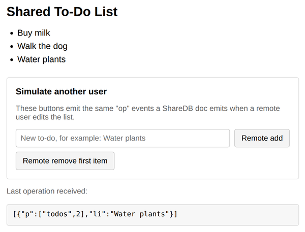

# Problem 3: Applying Remote Operations to the Page

Edit `Lesson 4.3/main-3.js`:

When several people share a ShareDB document, each browser hears about other users' edits through the document's `op` event. The document data updates automatically; your page does not. It is your code's job to read each incoming operation and update the DOM to match.

This page shows a shared to-do list. The document (`doc`), the DOM helper functions, and two "Simulate another user" buttons are already written. The buttons deliver real json0 operations to `doc` exactly the way a remote user's edits would arrive: a list insert uses `li`, and a list delete uses `ld`. In both cases `op.p[0]` names the list (`'todos'`) and `op.p[1]` is the position in the list.

Your job is the `TODO` at the bottom of `main-3.js`: register the `op` listener and apply each operation to the page.

1. Register a listener with `doc.on('op', ...)`. The listener receives a list of operations, so loop over it with `for (const op of ops)`.
2. Only handle operations whose path starts with the to-do list: `if (op.p[0] === 'todos')`.
3. If the operation has an `li` value, an item was inserted: call the provided `addTodoToDOM(op.li, op.p[1])`.
4. Otherwise, if it has an `ld` value, an item was deleted: call the provided `removeTodoFromDOM(op.p[1])`.

The full pattern is spelled out in the `TODO` comment in the file. Check `op.li !== undefined` and `op.ld !== undefined` rather than truthiness, so an inserted empty string would still count.

Do not edit `index.html`, `fake-doc-3.js`, or the provided code above the marked line. The list must start with the two provided items (`Buy milk` and `Walk the dog`), and after your change the page should update every time a simulated remote operation arrives. The "Last operation received" box shows each op as JSON so you can see what your listener just handled.

After typing `Water plants` and clicking `Remote add`, the page should look similar to this image:

## ShareDB documentation

- ShareDB Doc API (the `op` event you listen for): [documentation](https://share.github.io/sharedb/api/doc), [ShareDB docs home](https://share.github.io/sharedb/)
- json0 OT type (the `li` and `ld` actions): [spec](https://github.com/ottypes/json0), [npm package](https://www.npmjs.com/package/ot-json0/v/1.1.0)

---

Course 3, Module 3 - practice assignment (ungraded): [Practice: Real-Time Synchronization](https://www.coursera.org/learn/developing-full-stack-applications-with-javascript/programming/EGkKm/practice-real-time-synchronization) - `Lesson 4.3`

The files here are the starter you get in the course. The finished `main-3.js` is in the [solution folder on GitHub](https://github.com/soney/Practical-JavaScript/tree/main/assignments/Course%203/Module%203/Lesson%204/Lesson%204.3/solution); in the course codespace that folder is hidden so you can work the problem first.
