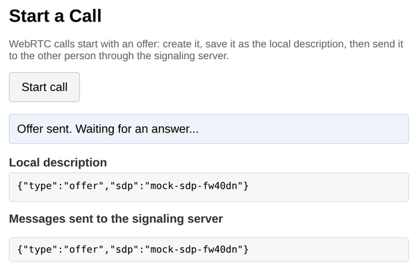

# Problem 1: Starting a WebRTC Call with an Offer

Edit `Lesson 5.1/main-1.js`:

A WebRTC call starts with an exchange of connection descriptions. The caller creates an "offer" that describes its side of the connection, saves that offer as its local description, and sends it to the other person through a signaling server. WebRTC never sends the offer for you; your code has to move it.

Note: this assignment does not create an actual peer connection. A real `RTCPeerConnection` needs a second live browser to talk to, which is tough to set up in the Coursera environment, so this page provides a mock `peerConnection` and a mock `signaling` server that behave like the real APIs: `createOffer()` returns a Promise for an offer object `{ type, sdp }`, `setLocalDescription(...)` stores what you pass it, and `signaling.send(message)` shows the message in the "Messages sent to the signaling server" list. You are writing the exact same `startCall` code you would write against the real APIs.

Your job is the `startCall` function, marked with the `TODO` comment in `main-1.js`. It must do these five things in order:

1. Show progress: `setStatus('Creating offer...');`
2. Create the offer. `createOffer()` returns a Promise, so `await` it: `const offer = await peerConnection.createOffer();`
3. Save the offer as this side's local description: `await peerConnection.setLocalDescription(offer);`
4. Send the offer to the other person through the signaling server: `signaling.send({ type: 'offer', sdp: offer.sdp });`
5. Show the result: `setStatus('Offer sent. Waiting for an answer...');`

Do not edit `index.html` or the provided code in `main-1.js`. The provided click handler runs your `startCall` and then displays `peerConnection.localDescription`, so you can check that step 3 really stored the offer.

After clicking `Start call`, the page should look similar to this image:

---

Course 3, Module 3 - practice assignment (ungraded): [Practice: Real-Time Peer-to-Peer Apps with WebRTC and Y.js](https://www.coursera.org/learn/developing-full-stack-applications-with-javascript/programming/BLBuH/practice-real-time-peer-to-peer-apps-with-webrtc-and-y-js) - `Lesson 5.1`

The files here are the starter you get in the course. The finished `main-1.js` is in the [solution folder on GitHub](https://github.com/soney/Practical-JavaScript/tree/main/assignments/Course%203/Module%203/Lesson%205/Lesson%205.1/solution); in the course codespace that folder is hidden so you can work the problem first.
