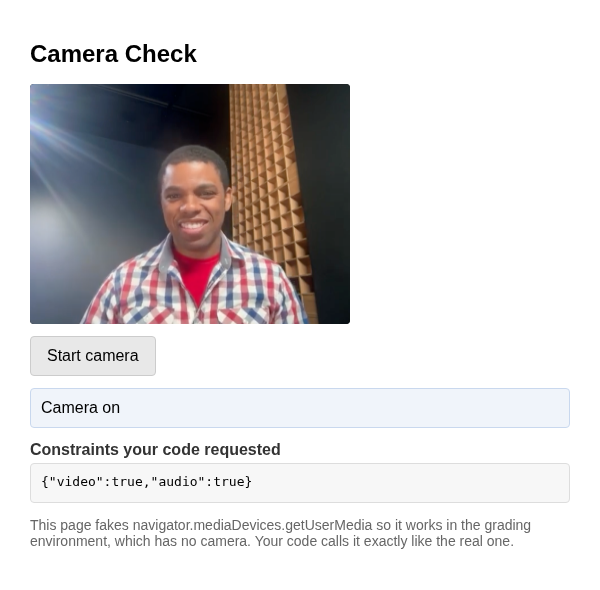

# Problem 2: Turning On the Camera for Video Chat

Edit `Lesson 5.2/main-2.js`:

Before a video chat can show anything, the browser has to ask the user for camera and microphone access. That is what `navigator.mediaDevices.getUserMedia(constraints)` does: it returns a Promise that resolves to a media stream when the user allows access, and rejects when they block it.

The grading environment has no camera, so the provided block in `main-2.js` replaces `getUserMedia` with a fake version that behaves like the real one. Your code calls it exactly like the real API.

Your job is the `startCamera` function, marked with the `TODO` comment in `main-2.js`:

1. Show progress first: `setStatus('Requesting camera...');`
2. Then, in a `try` block:
   - Ask for both inputs: `const stream = await navigator.mediaDevices.getUserMedia({ video: true, audio: true });`
   - Show the stream in the provided video element: `localVideo.srcObject = stream;`
   - Report success: `setStatus('Camera on');`
3. In the `catch` block, report the failure: `setStatus('Could not access the camera');` Asking for the camera can always fail, so real video chat code always handles the rejection.

Do not edit `index.html` or the provided code in `main-2.js` (the fake camera block and the button wiring). The page shows which constraints object your code requested, so you can check that you asked for `{ video: true, audio: true }`.

After clicking `Start camera`, the page should look similar to this image:

Your `catch` block still matters even though the page's fake camera always succeeds: the real `getUserMedia` rejects when the user denies permission, and the tests check that your code reports `Could not access the camera` when the request is rejected.

---

Course 3, Module 3 - practice assignment (ungraded): [Practice: Real-Time Peer-to-Peer Apps with WebRTC and Y.js](https://www.coursera.org/learn/developing-full-stack-applications-with-javascript/programming/BLBuH/practice-real-time-peer-to-peer-apps-with-webrtc-and-y-js) - `Lesson 5.2`

The files here are the starter you get in the course. [`solution/main-2.js`](solution/main-2.js) is the finished `main-2.js`; copy it over the starter to run the completed assignment.
