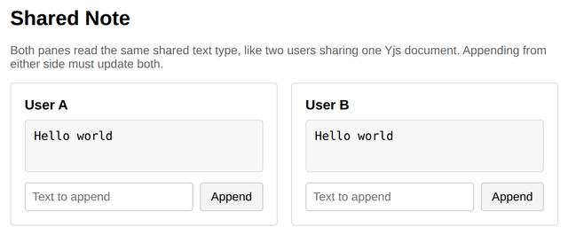

# Problem 3: A Yjs-Style Shared Text Type

Edit `Lesson 5.3/main-3.js`:

Yjs organizes shared data as named types inside a document. Calling `doc.getText('note')` anywhere in an app returns the same shared text object, and callbacks registered with `observe(...)` run whenever that text changes. This page builds a small version of that idea, with two panes standing in for two users of the same shared note.

The page and the pane wiring are already written. Each pane calls `doc.getText('note')`, registers an observer that re-renders the pane, and appends typed text with `note.insert(note.content.length, input.value)`. Your job is the two `TODO` comments in `main-3.js`:

1. Complete `doc.getText(name)`. The first call for a name must create the text type, and every later call for that same name must return the same object:

   ```js
   if (!doc.shared[name]) {
     doc.shared[name] = createTextType();
   }
   return doc.shared[name];
   ```

   This replaces the `return null;` line. Both panes call `getText('note')`, so if your version created a new object on every call, the two panes would hold different texts and would not stay in sync.

2. Complete `insert(index, newText)` inside `createTextType`. It must splice the new text into the content string at `index`, then notify every observer:

   ```js
   text.content = text.content.slice(0, index) + newText + text.content.slice(index);
   for (const callback of text.observers) {
     callback();
   }
   ```

Do not edit `index.html` or the provided code below the marked line in `main-3.js`.

When both parts work, appending text in either pane updates both panes, because both panes observe the same shared text. After typing `Hello ` in User A's box and clicking its `Append`, then typing `world` in User B's box and clicking its `Append`, the page should look similar to this image:



## Yjs documentation

This problem builds a tiny version of the real Yjs API by hand; it does not load the Yjs library. These links show the real types it mirrors:

- Yjs `Y.Text` (the shared text type this problem imitates, including `insert` and `observe`): [documentation](https://docs.yjs.dev/api/shared-types/y.text)
- Yjs `Y.Doc` (the shared document that hands back a named text with `doc.getText(name)`): [documentation](https://docs.yjs.dev/api/y.doc)
- Yjs: [docs home](https://docs.yjs.dev/), [github](https://github.com/yjs/yjs), [npm package](https://www.npmjs.com/package/yjs)

---

Course 3, Module 3 - practice assignment (ungraded): [Practice: Real-Time Peer-to-Peer Apps with WebRTC and Y.js](https://www.coursera.org/learn/developing-full-stack-applications-with-javascript/programming/BLBuH/practice-real-time-peer-to-peer-apps-with-webrtc-and-y-js) - `Lesson 5.3`

The files here are the starter you get in the course. The finished `main-3.js` is in the [solution folder on GitHub](https://github.com/soney/Practical-JavaScript/tree/main/assignments/Course%203/Module%203/Lesson%205/Lesson%205.3/solution); in the course codespace that folder is hidden so you can work the problem first.
