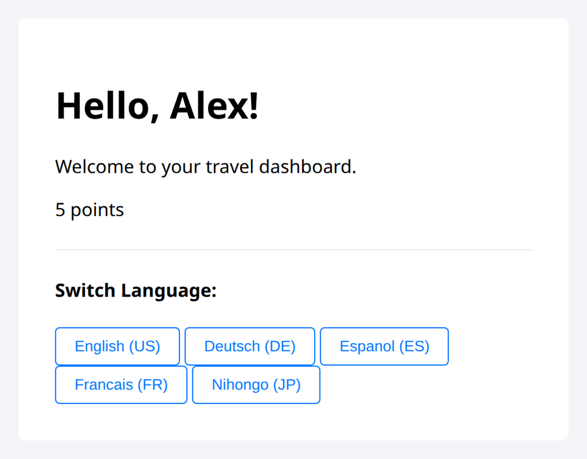

# Problem 1: Localization for a Travel Dashboard

Edit `Problem 1/main-1.js`:

Use the `i18next` library to localize the travel dashboard. The page in `index.html` already has the needed elements and language buttons and already loads `i18next` for you, so do not edit `index.html`.

Because `index.html` loads `i18next` before `main-1.js`, the global `i18next` object is already available in your code.

Use the existing data in `main-1.js`:

| Variable | Required value |
| --- | --- |
| `userData.name` | `Alex` |
| `userData.points` | `5` |

The `resources` object holds the translations for every locale (English, German, Spanish, French, and Japanese), all provided for you. `i18next` is also already initialized for you with `en-US` as the default language.

The existing language buttons call `changeLanguage(locale)` with the locale codes `en-US`, `de-DE`, `es-ES`, `fr-FR`, and `ja-JP`. That `changeLanguage(locale)` function is provided for you and already global, so the buttons keep working once `render()` is done.

Your job is to fill in `render()`:

1. In `render()`, set `document.documentElement.lang` to `i18next.language`.
2. In `render()`, set `#welcome` using `i18next.t('welcome', { name: userData.name })`. This should read `Hello, Alex!` for `en-US` and `Hallo, Alex!` for `de-DE`.
3. In `render()`, set `#tagline` using `i18next.t('tagline')`.
4. In `render()`, set `#points-label` using `i18next.t('points', { count: userData.points })`. Because the resource keys end in `_one` and `_other`, `i18next` picks the correct plural form: `5 points` for `en-US` and `5 Punkte` for `de-DE`.
After the page loads in the default `en-US` locale, the dashboard should look similar to this image:

---

Course 3, Module 4 - graded assignment: [Module 4 Graded Assignment](https://www.coursera.org/learn/developing-full-stack-applications-with-javascript/programming/X8xWS/module-4-graded-assignment) - `Problem 1`

The files here are the starter you get in the course. Solutions to graded
assignments are not published.
