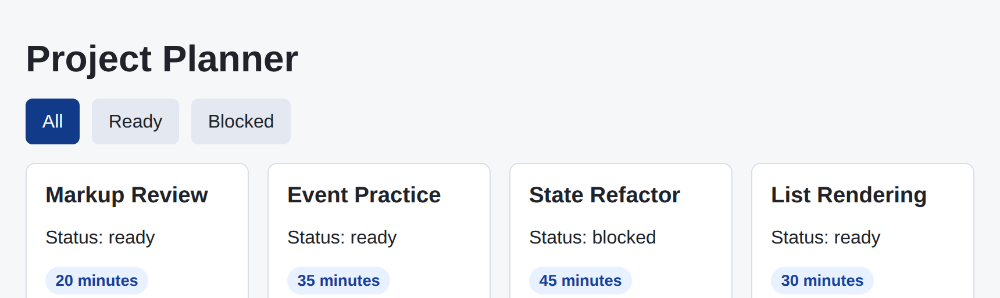
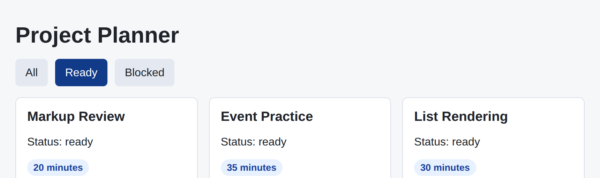

# Problem 1: React State for a Project Planner

Edit `Problem 1/main-1.jsx`:

Build a small React project planner that combines props, list rendering, conditional logic, event handlers, and state.

Within the file:

1. Update `ProjectCard` so it accepts a `project` prop.
2. Render the project title, status, and minutes inside each card. Show the status text exactly as it appears in the data (lowercase, for example `blocked`), and show the minutes as the number followed by a space and the word `minutes` (for example `20 minutes`).
3. Create a state variable called `selectedStatus` with the starting value `"all"`, using `React.useState`.
4. Compute a `visibleProjects` array from `selectedStatus`. When `selectedStatus` is `"all"`, `visibleProjects` holds every project. When `selectedStatus` is `"ready"` or `"blocked"`, `visibleProjects` holds only the projects whose `status` matches `selectedStatus`. (See "Writing the conditional logic" below.)
5. Use `visibleProjects.map(...)` to render one `ProjectCard` for each visible project, and give each card a stable `key` of `project.id`.
6. Make the `All`, `Ready`, and `Blocked` buttons update `selectedStatus` when clicked, for example `onClick={() => setSelectedStatus("ready")}`.
7. Highlight the button for the current filter so the selected filter stands out, instead of `All` always looking selected. Give the button that matches `selectedStatus` the class `active`, and give the other two buttons the class `secondary`. (See "Writing the conditional logic" below.)

## Writing the conditional logic

Steps 4 and 7 both pick a value based on the current `selectedStatus`. Use an `if` statement for each one.

For step 4, use an `if`/`else` to point `visibleProjects` at the whole list or a filtered list. Declare it with `let` (not `const`) so both branches can assign to it:

```jsx
let visibleProjects;
if (selectedStatus === "all") {
  visibleProjects = projects;
} else {
  visibleProjects = projects.filter((project) => project.status === selectedStatus);
}
```

For step 7, an `if` statement cannot go directly inside JSX `{}`, because `{}` expects a value (an expression), not a statement. Write a small helper function that uses an `if` and returns the class name, then call it for each button:

```jsx
function buttonClass(status) {
  if (status === selectedStatus) {
    return "active";
  }
  return "secondary";
}
```

```jsx
<button className={buttonClass("all")} onClick={() => setSelectedStatus("all")}>
  All
</button>
```

Use the same helper for the `Ready` and `Blocked` buttons, passing `"ready"` and `"blocked"`.

### A shorter alternative: the ternary

Each `if` above picks one of two values, and JavaScript has a compact form for exactly that: the ternary. A ternary is an expression of the form `condition ? valueWhenTrue : valueWhenFalse`. It checks `condition`, and the whole expression becomes `valueWhenTrue` when the condition is true and `valueWhenFalse` when it is false. Because a ternary is an expression (a value), you can use it anywhere JavaScript expects a value, including directly inside JSX `{}` -- which is why it does not need a helper function the way the `if` version does.

The same two steps written as ternaries:

```jsx
const visibleProjects =
  selectedStatus === "all"
    ? projects
    : projects.filter((project) => project.status === selectedStatus);
```

```jsx
<button
  className={selectedStatus === "all" ? "active" : "secondary"}
  onClick={() => setSelectedStatus("all")}
>
  All
</button>
```

Either style is fine for this assessment. Use whichever reads more clearly to you.

This assessment should feel like the Module 1 React lessons working together in one component tree.

The starting filter is `"all"`, so on load the `All` button is highlighted and every card is shown. The page should look similar to this image:



When you click one of the filter buttons, that button becomes highlighted (the `active` class) and only the matching cards remain. For example, after clicking `Ready`, the `Ready` button is highlighted and only the three ready projects are shown (the blocked project is hidden):



---

Course 4, Module 1 - graded assignment: [Module 1 Graded Assignment](https://www.coursera.org/learn/building-applications-with-react/programming/LQYJq/module-1-graded-assignment) - `Problem 1`

The files here are the starter you get in the course. Solutions to graded
assignments are not published.
