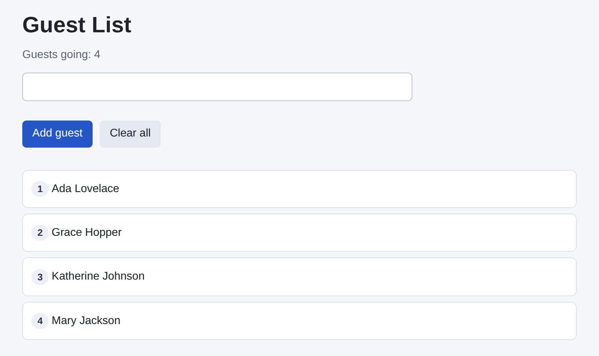

# Problem 2: React State for a Guest List

Edit `Problem 2/main-2.jsx`:

Build a guest list where people are added from an input and shown in a live list. This combines props, list rendering, conditional rendering, event handlers, and state, the way the Module 1 React lessons fit together.

Within the file:

1. Update `GuestRow` so it accepts a `name` prop and a `position` prop. Render the `position` inside the `.chip` span, and render the `name` as the text of the `li`.
2. Create a state variable called `guests` with the starting value `["Ada Lovelace", "Grace Hopper"]`.
3. Create a state variable called `inputValue` with the starting value `""`, and make the input controlled by setting `value={inputValue}` and `onChange={(event) => setInputValue(event.target.value)}`.
4. Complete `addGuest` so it:
   - Reads the trimmed input with `inputValue.trim()`.
   - Returns without changing the list when the trimmed value is empty.
   - Adds the trimmed name to `guests` without mutating the old array. Use the updater form with spread: `setGuests((currentGuests) => [...currentGuests, trimmedName])`. Do not use `.push()`.
   - Clears the input by calling `setInputValue("")`.
5. Complete `handleKeyDown(event)` so that when `event.key` is `"Enter"` it calls `addGuest()`, then attach it to the input with `onKeyDown={handleKeyDown}`.
6. Make the `Add guest` button call `addGuest` on click.
7. Make the `Clear all` button set `guests` back to an empty array on click.
8. Show the current guest count in the `.subtle` paragraph using `guests.length`, for example `Guests going: {guests.length}`.
9. When `guests` is empty, render the `.empty-state` paragraph using the logical `&&` operator so the message only appears when there are no guests.
10. Use `guests.map(...)` to render one `GuestRow` for each guest. Pass the guest name as the `name` prop, pass `index + 1` as the `position` prop, and give each row a stable `key` of the guest name.

This assessment should feel like the Module 1 React lessons working together in one component tree.

The resulting page should look similar to this image. The list starts with Ada Lovelace and Grace Hopper, so this screenshot shows the page after two more guests have been added, for a total of four:

---

Course 4, Module 1 - graded assignment: [Module 1 Graded Assignment](https://www.coursera.org/learn/building-applications-with-react/programming/LQYJq/module-1-graded-assignment) - `Problem 2`

The files here are the starter you get in the course. Solutions to graded
assignments are not published.
