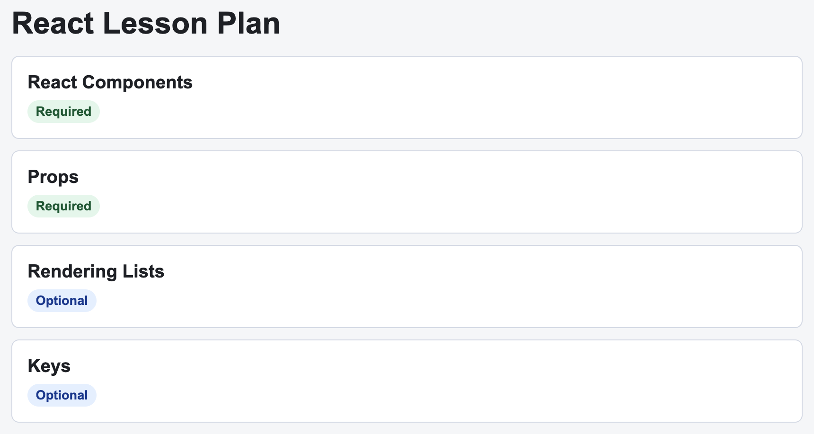

# Problem 2: React Keys for Lesson Lists

Edit `Lesson 2.2/main-2.jsx`:

Render the lesson data with `map(...)`, and give each rendered item a stable key.

Within the file:

1. Update `LessonList` so it accepts a `lessons` prop
2. If `lessons` is empty, render the text `No lessons available.`
3. Otherwise, use `lessons.map(...)` to render one `li` for each lesson, keeping the sample item's `lesson-item` class on each one
4. Put the lesson title in the `h2`
5. Show `Required` when `lesson.required` is true and `Optional` otherwise
6. Add a stable `key` prop to each item using `lesson.id`

This follows the list-rendering lesson: arrays can be transformed into React elements with `map(...)`.

The resulting page should look similar to this image:

---

Course 4, Module 1 - practice assignment (ungraded): [Practice: Creating React Components](https://www.coursera.org/learn/building-applications-with-react/programming/xUESM/practice-creating-react-components) - `Lesson 2.2`

The files here are the starter you get in the course. [`solution/main-2.jsx`](solution/main-2.jsx) is the finished `main-2.jsx`; copy it over the starter to run the completed assignment.
