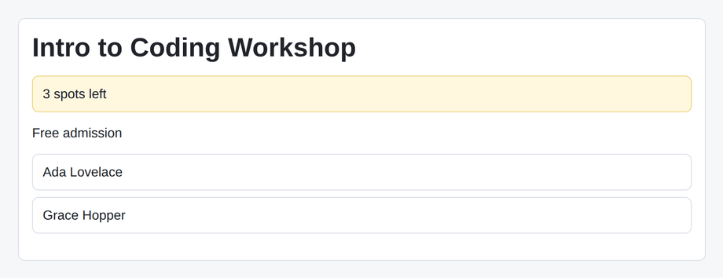

# Problem 3: JSX Expressions for Event Details

Edit `Lesson 2.3/main-3.jsx`:

Use JSX expressions and conditional rendering to display the `eventInfo` data.

Within the file:

1. Update `EventCard` so it accepts an `eventInfo` prop.
2. Render `eventInfo.name` inside the `h1`.
3. Build the spots text by combining the logical `&&` and `||` operators. Do not use a ternary (`? :`) here. `eventInfo.spotsLeft` is a number, so `0` is falsy and any positive count is truthy. Use `&&` to build the count text only when there are spots, then use `||` to fall back to `No spots left` when `eventInfo.spotsLeft` is `0`. So for `eventInfo.spotsLeft` of `3` this renders `3 spots left`, and for `0` it renders `No spots left` (not `0 spots left`). Do not hard-code the number.
4. Render that spots text inside the `.status-line` paragraph.
5. Use `eventInfo.isFree && ...` to render the text `Free admission` only when `eventInfo.isFree` is true.
6. Use `eventInfo.speakers.map(...)` to render one `<li>` for each speaker.
7. Add a `key` prop to each speaker item using the speaker name.

This practices the conditional rendering patterns from the lesson: JSX can use JavaScript expressions, and you combine the logical `&&` and `||` operators to pick text without a ternary, plus `map(...)` output for lists.

The resulting page should look similar to this image:

---

Course 4, Module 1 - practice assignment (ungraded): [Practice: Creating React Components](https://www.coursera.org/learn/building-applications-with-react/programming/xUESM/practice-creating-react-components) - `Lesson 2.3`

The files here are the starter you get in the course. The finished `main-3.jsx` is in the [solution folder on GitHub](https://github.com/soney/Practical-JavaScript/tree/main/assignments/Course%204/Module%201/Lesson%202/Lesson%202.3/solution); in the course codespace that folder is hidden so you can work the problem first.
