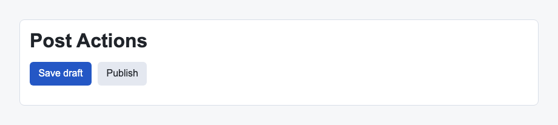

# Problem 1: React Events for Action Buttons

Edit `Lesson 3.1/main-1.jsx`:

Add React click event listeners to the action buttons.

Within `ActionButtons`:

1. Add `onClick={saveDraft}` to the `Save draft` button.
2. Add `onClick={publishPost}` to the `Publish` button.
3. Do not call either function during render. Pass the function reference to `onClick`.
4. Keep the existing `saveDraft` and `publishPost` function names.

React event listener props use camelCase names such as `onClick`, and the value should be a function that React can call later.

The resulting page should look similar to this image:

---

Course 4, Module 1 - practice assignment (ungraded): [Practice: Handling Events in React Components](https://www.coursera.org/learn/building-applications-with-react/programming/Uxidi/practice-handling-events-in-react-components) - `Lesson 3.1`

The files here are the starter you get in the course. [`solution/main-1.jsx`](solution/main-1.jsx) is the finished `main-1.jsx`; copy it over the starter to run the completed assignment.
