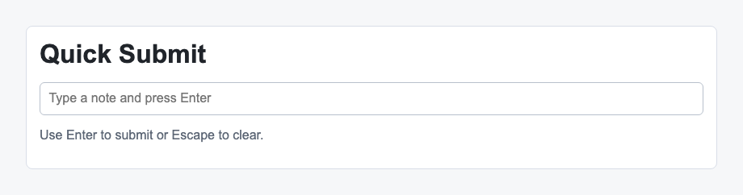

# Problem 2: React Keyboard Events for Quick Submit Input

Edit `Lesson 3.2/main-2.jsx`:

Use the React keyboard event object to read the pressed key and the input element.

A function `showSubmittedNote(note)` is **already provided for you** at the top of the file. When you call it, it displays the note on the page (in the `#submitted-note` element). It updates the page directly for now; you will learn the React way of showing data on screen, using state, in a later lesson.

Within the file:

1. Attach `handleKeyDown` to the text input with `onKeyDown={handleKeyDown}`.
2. In `handleKeyDown(event)`, check `event.key`.
3. When `event.key` is `"Enter"`, call `showSubmittedNote(event.target.value)` to display what was typed.
4. When `event.key` is `"Escape"`, clear the input by setting `event.target.value` to an empty string.

React passes an event object to event handlers. For keyboard events, `event.key` tells you which key was pressed, and `event.target` is the input element.

The resulting page should look similar to this image:

---

Course 4, Module 1 - practice assignment (ungraded): [Practice: Handling Events in React Components](https://www.coursera.org/learn/building-applications-with-react/programming/Uxidi/practice-handling-events-in-react-components) - `Lesson 3.2`

The files here are the starter you get in the course. The finished `main-2.jsx` is in the [solution folder on GitHub](https://github.com/soney/Practical-JavaScript/tree/main/assignments/Course%204/Module%201/Lesson%203/Lesson%203.2/solution); in the course codespace that folder is hidden so you can work the problem first.
