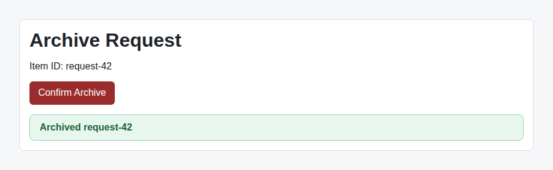

# Problem 3: Calling vs. Passing an Event Handler

Edit `Lesson 3.3/main-3.jsx`:

The `Confirm Archive` button should archive the item **only when the user clicks it**. Right now it archives the item immediately, as soon as the page loads, before anyone clicks anything.

The reason is a common React mistake. Look at the button inside `ConfirmButton`:

```jsx
<button className="danger" onClick={onConfirm(itemId)}>
```

Because of the parentheses, `onConfirm(itemId)` **runs right away**, while React is rendering the button, and its return value is handed to `onClick`. That is why the archive happens on load instead of on click.

What you want is to give `onClick` a function to run *later*, when the click actually happens, rather than the value returned by calling `onConfirm(itemId)` during render. The usual fix is to wrap the call in an arrow function, so `onClick` receives something to run on click instead of a value computed now.

Your task: in `ConfirmButton`, rewrite the button's `onClick` so that `onConfirm(itemId)` runs only when the button is clicked, not during render. Keep the button text `Confirm Archive`. When it is correct, the status banner stays a gray `Not archived yet.` when the page loads. Only after you click the button does it turn green and change to `Archived request-42`.

The screenshot below shows the page **after** you click `Confirm Archive`: the banner has turned green and reads `Archived request-42`. Before the click (and before your fix, since the broken version archives on load), the banner is instead a gray `Not archived yet.`



---

Course 4, Module 1 - practice assignment (ungraded): [Practice: Handling Events in React Components](https://www.coursera.org/learn/building-applications-with-react/programming/Uxidi/practice-handling-events-in-react-components) - `Lesson 3.3`

The files here are the starter you get in the course. [`solution/main-3.jsx`](solution/main-3.jsx) is the finished `main-3.jsx`; copy it over the starter to run the completed assignment.
