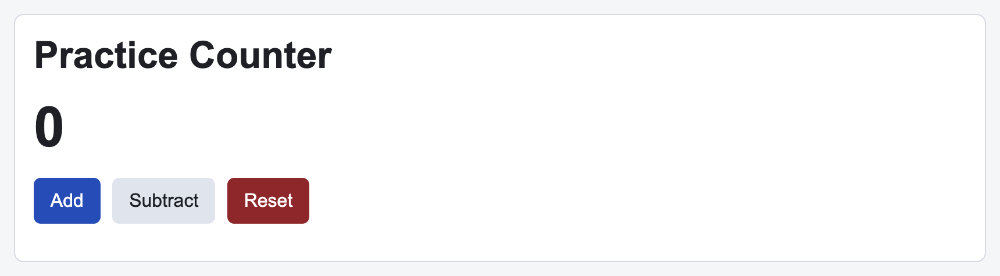

# Problem 1: React State for a Counter

Edit `Lesson 4.1/main-1.jsx`:

Use React state to make the counter update when the buttons are clicked.

Within `Counter`:

1. Replace the local `count` variable with a state variable created by `React.useState(0)`
2. Make the `Add` button increase the count by 1
3. Make the `Subtract` button decrease the count by 1
4. Make the `Reset` button set the count back to 0
5. Render the current state value inside the element with class `counter-value`

Use the setter returned by `React.useState`. Updating a local variable will not tell React to render again.

The resulting page should look similar to this image:

---

Course 4, Module 1 - practice assignment (ungraded): [Practice: Managing State in React Components](https://www.coursera.org/learn/building-applications-with-react/programming/HOBhG/practice-managing-state-in-react-components) - `Lesson 4.1`

The files here are the starter you get in the course. The finished `main-1.jsx` is in the [solution folder on GitHub](https://github.com/soney/Practical-JavaScript/tree/main/assignments/Course%204/Module%201/Lesson%204/Lesson%204.1/solution); in the course codespace that folder is hidden so you can work the problem first.
