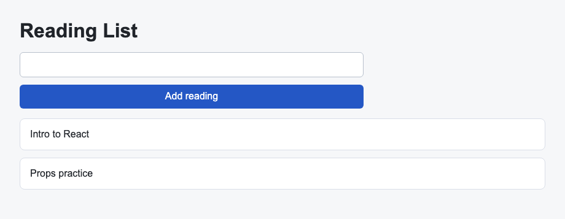

# Problem 2: Array State for a Reading List

Edit `Lesson 4.2/main-2.jsx`:

Update array state without mutating the existing array.

Within `ReadingList`:

1. Complete the `addItem` function by:
    - Using the `inputValue` state variable to get the current value of the input field.
    - If `inputValue.trim()` is empty, return without changing the list.
    - Use the `setItems` setter to update the `items` state variable to a new array that contains the current items and the trimmed input value.
        - Build that new array with spread syntax: `...currentItems` copies every existing item into the new array, and you put the trimmed input value right after it. The whole array looks like `[...currentItems, inputValue.trim()]`, so the copied items come first and the new reading is added onto the end.
        - Do not use `.push()` to mutate the `items` array.
    - After adding a valid item, set `inputValue` back to an empty string using the `setInputValue` setter.

React state should be replaced with a new array when list data changes. Mutating the existing state array can make rerenders unreliable.

The resulting page should look similar to this image:

---

Course 4, Module 1 - practice assignment (ungraded): [Practice: Managing State in React Components](https://www.coursera.org/learn/building-applications-with-react/programming/HOBhG/practice-managing-state-in-react-components) - `Lesson 4.2`

The files here are the starter you get in the course. [`solution/main-2.jsx`](solution/main-2.jsx) is the finished `main-2.jsx`; copy it over the starter to run the completed assignment.
