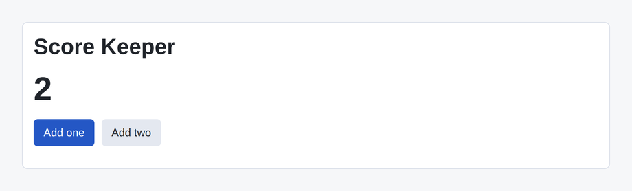

# Problem 3: State Updaters for a Score Keeper

Edit `Lesson 4.3/main-3.jsx`:

Use updater functions when the next state depends on the previous state.

Within `ScoreKeeper`:

1. Keep the `score` state variable starting at `0`.
2. Update `addOne` so it calls `setScore` with an updater function whose parameter is named `currentScore`.
3. The `addOne` updater function should return `currentScore` plus `1`.
4. Update `addTwo` so it calls `setScore` twice, each time with an updater function whose parameter is named `currentScore`.
5. Each updater function in `addTwo` should return `currentScore` plus `1`.
6. Inside `addOne` and `addTwo`, base the new value only on each updater's `currentScore` parameter, never on the `score` variable directly. (`score` holds the value from the current render, so if `addTwo` read `score` twice it would start both increments from the same number and end up adding only one.)

React state values are snapshots for the current render. Updater functions receive the latest pending state value.

The image below shows the score keeper after clicking **Add two** once. When the page first loads, the score starts at `0`.

---

Course 4, Module 1 - practice assignment (ungraded): [Practice: Managing State in React Components](https://www.coursera.org/learn/building-applications-with-react/programming/HOBhG/practice-managing-state-in-react-components) - `Lesson 4.3`

The files here are the starter you get in the course. The finished `main-3.jsx` is in the [solution folder on GitHub](https://github.com/soney/Practical-JavaScript/tree/main/assignments/Course%204/Module%201/Lesson%204/Lesson%204.3/solution); in the course codespace that folder is hidden so you can work the problem first.
