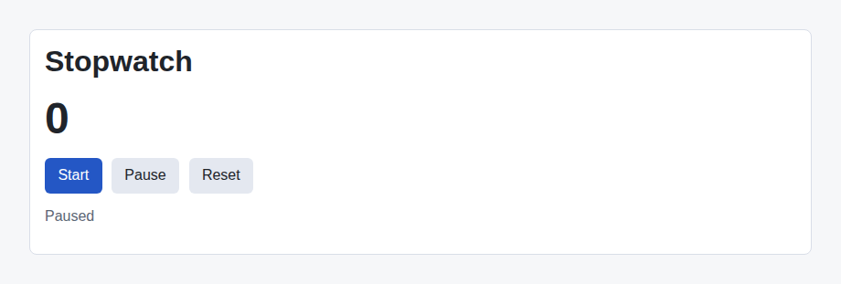

# Problem 1: A Stopwatch with State and an Effect

Edit `Problem 1/main-1.jsx`:

Build a stopwatch that counts up one second at a time. This brings together the two core Module 2 hooks: state with `React.useState`, and a side effect with `React.useEffect` that starts a timer and cleans it up.

Within `Stopwatch`:

1. Create a state variable `elapsedSeconds` with the starting value `0`
2. Create a state variable `running` with the starting value `false`
3. Show the live `elapsedSeconds` value in the `
` element instead of the hardcoded `0`
4. Add a `React.useEffect` that starts an interval with `setInterval` only while `running` is `true`, adding one to `elapsedSeconds` every second (1000 milliseconds). Inside the interval callback, update with the functional form `setElapsedSeconds((currentSeconds) => currentSeconds + 1)` so every tick reads the latest value
5. Return a cleanup function from the effect that calls `clearInterval`, and use `[running]` as the dependency array so the interval starts and stops only when `running` changes
6. Make the `Start` button set `running` to `true`, and the `Pause` button set `running` to `false`
7. Make the `Reset` button set `elapsedSeconds` back to `0` and set `running` to `false`
8. Show `Running` when `running` is `true`, otherwise show `Paused`

Effects that start timers must also clean them up. Without the cleanup, each time you paused and started again a new interval would stack on top of the old one, and the count would jump by more than one every second.

The resulting page should look similar to this image:

---

Course 4, Module 2 - graded assignment: [Module 2 Graded Assignment](https://www.coursera.org/learn/building-applications-with-react/programming/0NOJd/module-2-graded-assignment) - `Problem 1`

The files here are the starter you get in the course. Solutions to graded
assignments are not published.
