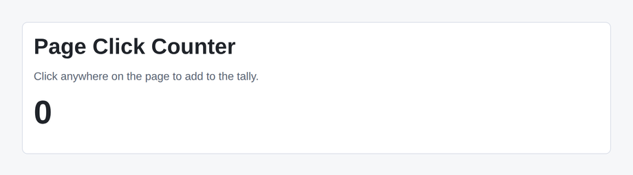

# Problem 2: A Window Click Listener with Cleanup

Edit `Problem 2/main-2.jsx`:

Build a counter that goes up by one every time the user clicks anywhere on the page, not just on a single button. Because a click anywhere on the page bubbles up to the `window`, the counter listens for `click` events on `window` from inside an effect, and removes that listener when the component goes away.

The component wiring is already in place: the `ClickCounter` component holds a `count` state variable (starting at `0`) and shows it in ``. Right now nothing happens when you click because no listener has been added yet. Your job is to add the effect.

Inside `ClickCounter`, add a `React.useEffect` call that:

1. Defines a `handleClick` function that increases the count by one. Use the functional updater form, `setCount((current) => current + 1)`, so each click reads the latest count.
2. Adds `handleClick` as a `"click"` listener on `window` with `window.addEventListener("click", handleClick)`.
3. Returns a cleanup function that removes the same listener with `window.removeEventListener("click", handleClick)`.
4. Uses an empty dependency array, `[]`, so the listener is added once when the component mounts and removed once when it unmounts.

Returning a cleanup function is the important habit here: an effect that adds an event listener should always remove it, otherwise repeated mounts would stack up duplicate listeners that keep firing. Once the effect is in place, clicking anywhere on the page increases the count.

The resulting page should look similar to this image:

---

Course 4, Module 2 - graded assignment: [Module 2 Graded Assignment](https://www.coursera.org/learn/building-applications-with-react/programming/0NOJd/module-2-graded-assignment) - `Problem 2`

The files here are the starter you get in the course. Solutions to graded
assignments are not published.
