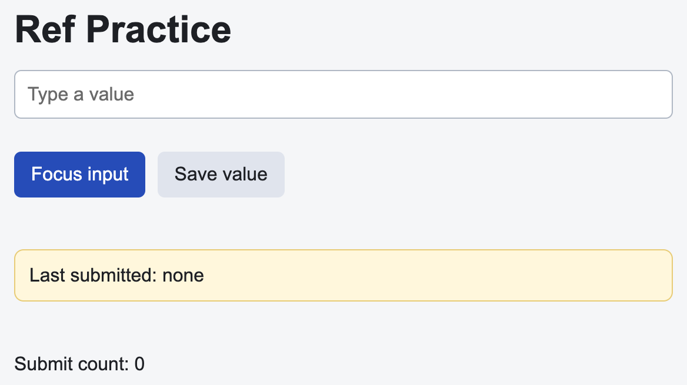

# Problem 1: React Refs for Input Focus

Edit `Lesson 1.1/main-1.jsx`:

Use refs to focus an input and read its current DOM value.

Within `RefPractice`:

1. Create an `inputRef` with `React.useRef(null)`
2. Attach `inputRef` to the text input with the `ref` attribute
3. Create a second ref called `lastSubmittedRef` with `React.useRef("")`
4. Make `focusInput` call `inputRef.current.focus()`
5. Make `saveValue` store `inputRef.current.value` in `lastSubmittedRef.current`
6. Update the rendered `submittedValue` state to show the latest saved value
7. Increase the submit count each time the value is saved

Refs should store values that survive renders without directly controlling what React renders.

The resulting page should look similar to this image:

---

Course 4, Module 2 - practice assignment (ungraded): [Practice: Hooks Fundamentals](https://www.coursera.org/learn/building-applications-with-react/programming/Jl78u/practice-hooks-fundamentals) - `Lesson 1.1`

The files here are the starter you get in the course. [`solution/main-1.jsx`](solution/main-1.jsx) is the finished `main-1.jsx`; copy it over the starter to run the completed assignment.
