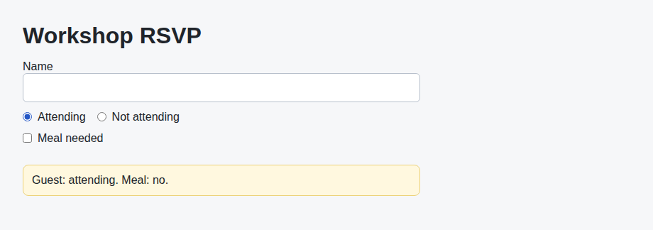
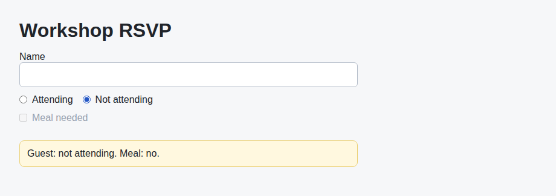

# Problem 2: Controlled Inputs for an RSVP Form

Edit `Lesson 1.2/main-2.jsx`:

Make the RSVP form use controlled React inputs.

Within `RSVPForm`:

1. Keep the `name`, `attendance`, and `needsMeal` state variables (and the `mealRequested` value that is already written for you).
2. Set the name input `value` to `name`.
3. Add an `onChange` handler to the name input that calls `setName(event.target.value)`.
4. Set the `Attending` radio input `checked` value from whether `attendance` is `"yes"`.
5. Set the `Not attending` radio input `checked` value from whether `attendance` is `"no"`.
6. Add `onChange` handlers to both radio inputs that call `setAttendance(event.target.value)`.
7. Set the checkbox `checked` value to `mealRequested`.
8. Add an `onChange` handler to the checkbox that calls `setNeedsMeal(event.target.checked)`.
9. Disable the checkbox while the guest is not attending by setting `disabled` to `attendance === "no"`.

Controlled inputs keep the current form values in React state and use event objects to update that state. The `disabled` prop is driven by state too, so a meal cannot be requested unless the guest is attending.

When the page first loads, `Attending` is selected and `Meal needed` is unchecked, so the page should look similar to this image:

After selecting `Attending` and checking `Meal needed`, the summary should update like this:

After selecting `Not attending`, the `Meal needed` checkbox becomes disabled and greyed out, and the summary reports no meal:

---

Course 4, Module 2 - practice assignment (ungraded): [Practice: Hooks Fundamentals](https://www.coursera.org/learn/building-applications-with-react/programming/Jl78u/practice-hooks-fundamentals) - `Lesson 1.2`

The files here are the starter you get in the course. The finished `main-2.jsx` is in the [solution folder on GitHub](https://github.com/soney/Practical-JavaScript/tree/main/assignments/Course%204/Module%202/Lesson%201/Lesson%201.2/solution); in the course codespace that folder is hidden so you can work the problem first.
