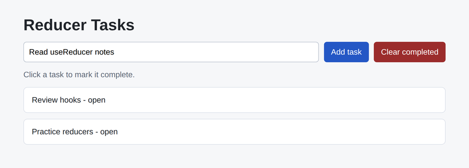

# Problem 3: Reducers for a Task Board

Edit `Lesson 1.3/main-3.jsx`:

This task board is built with `useReducer`. Almost everything is already wired up
for you:

- A text input that already holds a starting value. Whatever it holds is the text
  of the next task you add.
- An **Add task** button that reads the input, picks a fresh `id`, and dispatches
  an `"add"` action carrying `action.text` and `action.id`.
- Clicking a task marks it complete (it dispatches a `"complete"` action). That
  case is already written for you with `state.map(...)`.
- A **Clear completed** button that removes finished tasks. That case is already
  written for you with `state.filter(...)`.

Your job is to finish the one missing piece: the `"add"` case in `taskReducer`.

Inside `taskReducer(state, action)`, in the `action.type === "add"` branch:

1. Return a **new** array made of the current tasks plus one new task at the end.
2. Copy the current array with spread syntax so you do not change the old one:
   `[...state, newTask]`.
3. The new task object should be `{ id: action.id, text: action.text, done: false }`
   (the id and text come from the action; a brand-new task is not done yet).
4. Do not mutate the existing `state` array or its task objects (no `push`).

Reducers receive the current state and an action object, then return the next
state for React to render. Notice how the provided `"complete"` and
`"clear-completed"` cases build a new array with `map` and `filter` instead of
changing the old one -- your `"add"` case follows the same rule using spread.

The resulting page should look similar to this image:

---

Course 4, Module 2 - practice assignment (ungraded): [Practice: Hooks Fundamentals](https://www.coursera.org/learn/building-applications-with-react/programming/Jl78u/practice-hooks-fundamentals) - `Lesson 1.3`

The files here are the starter you get in the course. [`solution/main-3.jsx`](solution/main-3.jsx) is the finished `main-3.jsx`; copy it over the starter to run the completed assignment.
