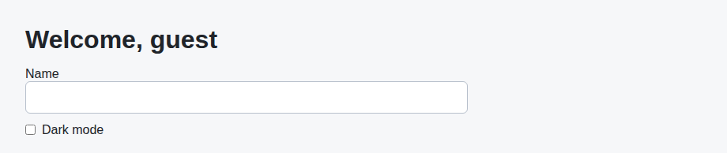

# Problem 1: Effects for Browser Preferences

Edit `Lesson 2.1/main-1.jsx`:

Use an effect with a dependency array to synchronize React state with the browser page.

Within `Preferences`:

1. Add a `React.useEffect` that adds the `dark-mode` class to `document.body` when dark mode is checked
    - Add and remove the class through `document.body.classList`:
        - `document.body.classList.add("dark-mode")` adds it
        - `document.body.classList.toggle("dark-mode", darkMode)` adds or removes it in one call based on the boolean.
2. The dark mode effect should remove the `dark-mode` class when dark mode is unchecked
    - Remove the class through `document.body.classList`:
        - `document.body.classList.remove("dark-mode")` removes it
        - `document.body.classList.toggle("dark-mode", darkMode)` adds or removes it in one call based on the boolean.
3. Give the dark mode effect the dependency array `[darkMode]`
4. Return a cleanup function from the dark mode effect that removes the `dark-mode` class

This matches the dependency lesson: effects should list the state values they depend on.

The resulting page should look similar to this image:

When dark mode is checked, adding the `dark-mode` class to `document.body` restyles the page like this:

---

Course 4, Module 2 - practice assignment (ungraded): [Practice: `useEffect` and Side Effects](https://www.coursera.org/learn/building-applications-with-react/programming/6PznH/practice-useeffect-and-side-effects) - `Lesson 2.1`

The files here are the starter you get in the course. The finished `main-1.jsx` is in the [solution folder on GitHub](https://github.com/soney/Practical-JavaScript/tree/main/assignments/Course%204/Module%202/Lesson%202/Lesson%202.1/solution); in the course codespace that folder is hidden so you can work the problem first.
