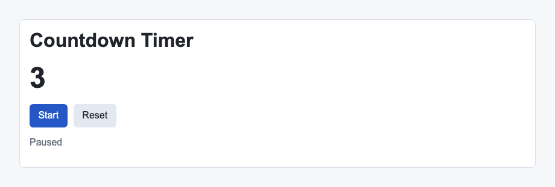

# Problem 2: Effect Cleanup for a Countdown Timer

Edit `Lesson 2.2/main-2.jsx`:

Use an effect to run and clean up an interval for the countdown timer.

Within `CountdownTimer`:

1. Add a `React.useEffect` call.
2. If `running` is false, the effect should not start an interval.
3. If `seconds` is `0`, the effect should not start an interval.
4. When the timer is running and `seconds` is greater than `0`, start a `setInterval` that subtracts `1` every `1000` milliseconds.
5. Use `setSeconds` with an updater function inside the interval callback.
6. Return a cleanup function from the effect.
7. The cleanup function should call `clearInterval` with the interval ID.
8. Give the effect a dependency array containing `running` and `seconds`.

Effects that start timers should also clean them up so old intervals do not keep running after state changes.

The resulting page should look similar to this image:

---

Course 4, Module 2 - practice assignment (ungraded): [Practice: `useEffect` and Side Effects](https://www.coursera.org/learn/building-applications-with-react/programming/6PznH/practice-useeffect-and-side-effects) - `Lesson 2.2`

The files here are the starter you get in the course. The finished `main-2.jsx` is in the [solution folder on GitHub](https://github.com/soney/Practical-JavaScript/tree/main/assignments/Course%204/Module%202/Lesson%202/Lesson%202.2/solution); in the course codespace that folder is hidden so you can work the problem first.
