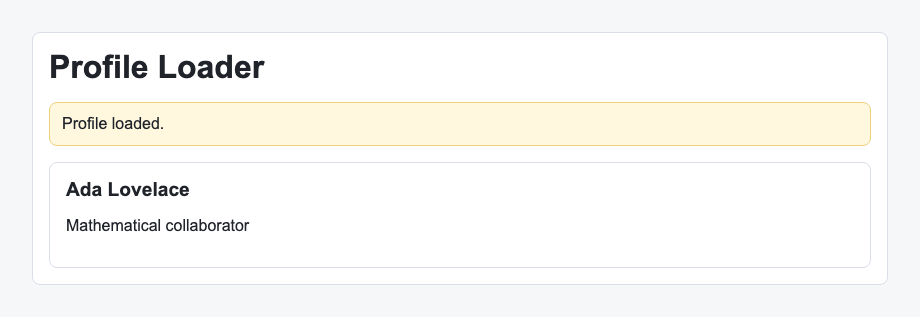

# Problem 3: Effects for Profile Loading

Edit `Lesson 2.3/main-3.jsx`:

Use an effect to load profile data after the component renders.

Within `ProfileLoader`:

1. Add a `React.useEffect` call.
2. Inside the effect, set `status` to `Loading profile...`.
3. Call the existing `loadProfile()` function inside the effect. It returns a promise that resolves to the profile object.
4. When that promise resolves, store the returned object in `profile` state. You can chain `.then(...)` onto `loadProfile()`, or define an inner `async` function that uses `await` and call it; do not make the effect callback itself `async`.
5. After storing the profile, set `status` to `Profile loaded.`.
6. Give the effect an empty dependency array, `[]`, so it runs once after the first render.
7. Return a cleanup function that prevents setting state if the component has already been cleaned up.

Effects are used for side effects such as loading data from a system outside the render function.

After the profile finishes loading, the page should look similar to this image:

---

Course 4, Module 2 - practice assignment (ungraded): [Practice: `useEffect` and Side Effects](https://www.coursera.org/learn/building-applications-with-react/programming/6PznH/practice-useeffect-and-side-effects) - `Lesson 2.3`

The files here are the starter you get in the course. The finished `main-3.jsx` is in the [solution folder on GitHub](https://github.com/soney/Practical-JavaScript/tree/main/assignments/Course%204/Module%202/Lesson%202/Lesson%202.3/solution); in the course codespace that folder is hidden so you can work the problem first.
