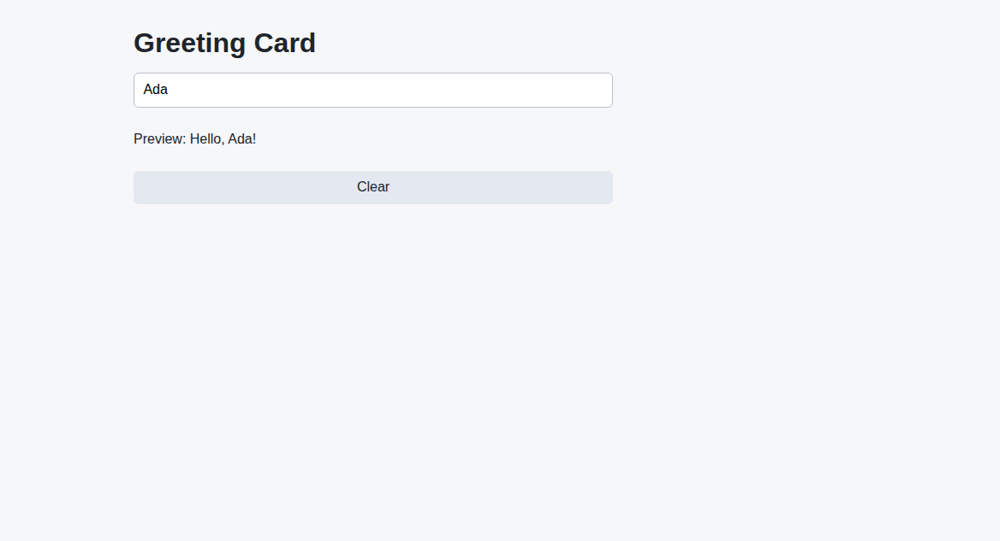

# Problem 1: Custom Hooks for a Greeting Field

Edit `Lesson 3.1/main-1.jsx`:

Create a custom hook that manages the text typed into an input field.

Within `useInput`:

1. Keep the function name `useInput`.
2. Create a `value` state variable with `React.useState(initialValue)`.
3. Return an object with three members: `value`, `onChange`, and `reset`.
4. `value` should be the current state value.
5. `onChange` should be an event handler that sets the value to `event.target.value`.
6. `reset` should set the value back to `initialValue`.

The input and the Clear button in `GreetingCard` are already wired to this hook, so completing `useInput` makes the greeting update as you type and the Clear button empty the field.

Custom hooks let you move reusable state logic into a named function that starts with `use`.

The resulting page should look similar to this image:

---

Course 4, Module 2 - practice assignment (ungraded): [Practice: Performance and Custom Hooks](https://www.coursera.org/learn/building-applications-with-react/programming/UiGyP/practice-performance-and-custom-hooks) - `Lesson 3.1`

The files here are the starter you get in the course. [`solution/main-1.jsx`](solution/main-1.jsx) is the finished `main-1.jsx`; copy it over the starter to run the completed assignment.
