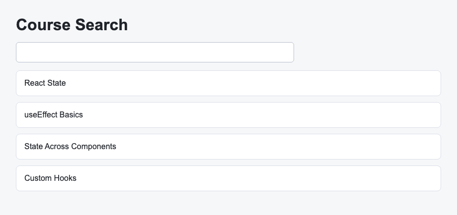

# Problem 2: Memoization for Course Search

Edit `Lesson 3.2/main-2.jsx`:

Use `React.useMemo` to derive the visible course list from the current search text.

Within `CourseSearch`:

1. Replace `const visibleCourses = courses;` with a `React.useMemo` call.
    - `React.useMemo` takes two arguments: a function that computes and returns a value, and a dependency array.
    - The shape is `React.useMemo(() => { ... return result; }, [deps])`.
    - React runs the function and remembers (memoizes) its return value, only re-running the function when a value in the dependency array changes.
    - Whatever the function returns becomes `visibleCourses`.
2. The memo callback should return every course when `searchText` is empty.
3. The memo callback should use `courses.filter(...)` to narrow the list when `searchText` contains text.
    - `courses.filter(...)` takes a callback that receives one course at a time; return `true` to keep that course and `false` to drop it.
    - It returns a new array containing only the courses whose callback returned `true`.
4. The filter should match course titles case-insensitively.
    - Use `.includes(...)` to test whether a title contains the search text.
    - Lowercase both sides before comparing so capitalization does not matter, for example `course.toLowerCase().includes(searchText.toLowerCase())`.
5. Give `React.useMemo` the dependency array `[searchText]`.

`useMemo` can memoize derived values when the calculation depends on specific state values.

The resulting page should look similar to this image:

---

Course 4, Module 2 - practice assignment (ungraded): [Practice: Performance and Custom Hooks](https://www.coursera.org/learn/building-applications-with-react/programming/UiGyP/practice-performance-and-custom-hooks) - `Lesson 3.2`

The files here are the starter you get in the course. [`solution/main-2.jsx`](solution/main-2.jsx) is the finished `main-2.jsx`; copy it over the starter to run the completed assignment.
