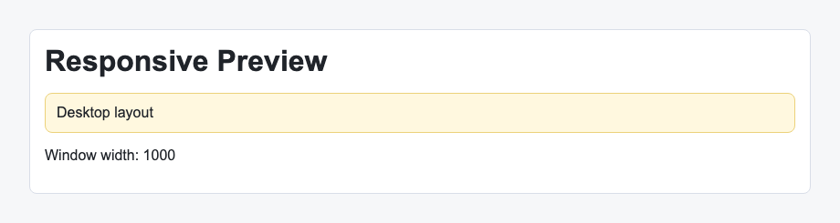

# Problem 3: Custom Hooks for Window Width

Edit `Lesson 3.3/main-3.jsx`:

Create a custom hook that tracks the current browser window width.

Within `useWindowWidth`:

1. Create a `width` state variable with the initial value `window.innerWidth`.
2. Add a `React.useEffect` call.
3. Inside the effect, define a `handleResize` function.
4. `handleResize` should update `width` to `window.innerWidth`.
5. Add a `resize` event listener to `window` inside the effect.
6. Return a cleanup function that removes the same `resize` event listener.
7. Give the effect an empty dependency array, `[]`.
8. Return the current `width` value from `useWindowWidth`.

Custom hooks let you package reusable stateful behavior, like keeping component state in sync with the browser window.

The resulting page should look similar to this image:

---

Course 4, Module 2 - practice assignment (ungraded): [Practice: Performance and Custom Hooks](https://www.coursera.org/learn/building-applications-with-react/programming/UiGyP/practice-performance-and-custom-hooks) - `Lesson 3.3`

The files here are the starter you get in the course. [`solution/main-3.jsx`](solution/main-3.jsx) is the finished `main-3.jsx`; copy it over the starter to run the completed assignment.
