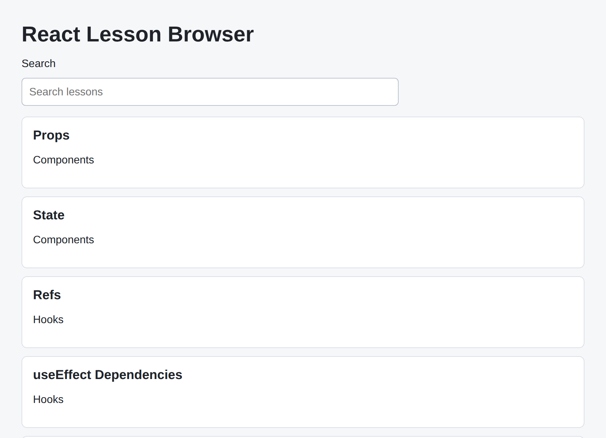

# Problem 1: React State and Rendering for a Lesson Browser

Edit `Problem 1/main-1.jsx`:

Build a React lesson browser: a search box filters a list of lessons. The `App` component and the `lessons` array are already written for you, and `App` already passes each component the props it needs. Your job is to complete the two components.

1. `SearchBox` receives `query` and `onQueryChange` props. Make the `<input>` a controlled input: set its `value` to `query`, and in its `onChange` call `onQueryChange(event.target.value)`.

2. `LessonResults` receives `lessons` and `query` props.
    - Filter the lessons whose `title` or `module` contains the query, ignoring capitalization. Call the filtered array `visibleLessons`. (See "Filtering the lessons" below.)
    - If no lessons match (`visibleLessons.length === 0`), render `<p className="empty-state">No matching lessons.</p>`.
    - Otherwise render a `<ul className="results-list">`. Use `visibleLessons.map(...)` to render each matching lesson as an `<li className="lesson-item">` with a stable `key={lesson.id}`. Inside each item, show the lesson's `title` and `module`.

## Filtering the lessons

Use `.filter()` to build the `visibleLessons` array. Keep a lesson when the query appears in its `title` or its `module`. To ignore capitalization, lowercase both the query and the field with `toLowerCase()` before checking with `.includes()`, so typing `hook` matches the `Hooks` module:

```jsx
const q = query.toLowerCase();
const visibleLessons = lessons.filter((lesson) =>
  lesson.title.toLowerCase().includes(q) ||
  lesson.module.toLowerCase().includes(q)
);
```

Because every string includes the empty string `""`, an empty query keeps all five lessons, so they all show until the learner types something.

The resulting page should look similar to this image:



---

Course 4, Module 3 - graded assignment: [Module 3 Graded Assignment](https://www.coursera.org/learn/building-applications-with-react/programming/Gklbj/module-3-graded-assignment) - `Problem 1`

The files here are the starter you get in the course. Solutions to graded
assignments are not published.
