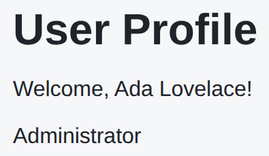

# Problem 2: React Context for a User Profile

Edit `Problem 2/main-2.jsx`:

Use React context to share a `user` object with nested components, without passing it down through props. The `user` object and the `Greeting` and `Badge` components are already written for you; your job is to connect them through context.

1. Create a context with `React.createContext(null)` and store it in a variable named `UserContext`.

2. In `Greeting`, read the user from context with `React.useContext(UserContext)` and use the user's `name` so the paragraph shows `Welcome, <name>!`.

3. In `Badge`, read the user from context the same way and show the user's `role`.

4. In `App`, wrap the `<h1>`, `<Greeting />`, and `<Badge />` in a `<UserContext.Provider value={user}>` so the two components can read the `user` from context.

The resulting page should look similar to this image:

---

Course 4, Module 3 - graded assignment: [Module 3 Graded Assignment](https://www.coursera.org/learn/building-applications-with-react/programming/Gklbj/module-3-graded-assignment) - `Problem 2`

The files here are the starter you get in the course. Solutions to graded
assignments are not published.
