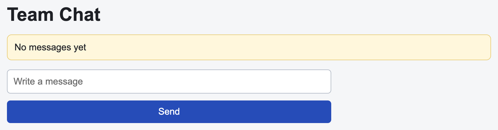

# Problem 1: Lifted State for Chat Messages

Edit `Lesson 1.1/main-1.jsx`:

Lift chat message state into `App`, then pass values down and callback props back up.

Within the file:

1. Update `ChatInput` so it accepts `value`, `onValueChange`, and `onSendMessage` props
2. Make the input controlled by the `value` prop
3. Call `onValueChange(event.target.value)` when the input changes (here `event` is the argument your `onChange` handler receives from React, and `event.target.value` is the input's current text)
4. Call `onSendMessage` when the button is clicked
5. Also call `onSendMessage` when the user presses Enter in the input
6. Update `ChatMessages` so it accepts a `messages` prop
7. Render `No messages yet` when there are no messages
8. Use `messages.map(...)` to render each message in a list item
9. In `App`, make `sendMessage` add the trimmed input value to `messages` and then clear the input

This follows the callback props and lifting state lessons: child components can notify a parent by calling functions received through props.

When the page first loads, before any messages are sent, it should look similar to this image:

---

Course 4, Module 3 - practice assignment (ungraded): [Practice: State Across Components](https://www.coursera.org/learn/building-applications-with-react/programming/412bq/practice-state-across-components) - `Lesson 1.1`

The files here are the starter you get in the course. [`solution/main-1.jsx`](solution/main-1.jsx) is the finished `main-1.jsx`; copy it over the starter to run the completed assignment.
